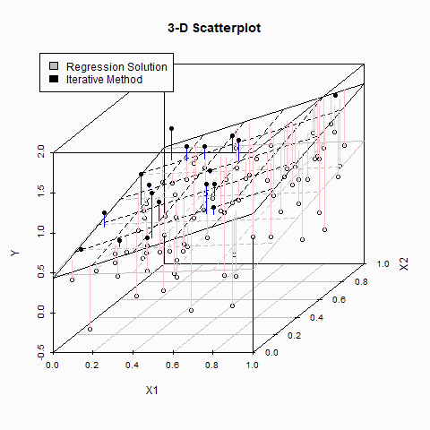

Hello internet, welcome to my personal website 🐣! First time doing this, let's see how it goes!

## Display some Math:
Einstein's famous Mass-energy equivalence formula 🌌:

$$ E = mc^2 $$

From wiki: The formula defines the energy E of a particle in its rest frame as the product of mass m with the speed of light squared (c²).

The 🔔 Curve:
With the probability density function:

$$ f(x | μ, σ^2) = \frac{1}{\sqrt{2 \pi \sigma^2}} \exp \left( -\frac{(x - μ)^2}{2 \sigma^2} \right) $$

Where **μ** is the mean or expectation of the distribution and **σ** is the standard deviation. i.e. variance of **σ²**. It is also known as the *Gaussian Distribution* or more commonly known as the [*Normal Distribution*](https://en.wikipedia.org/wiki/Normal_distribution).
An example graph of the function:

<center>

</center>

## Embedding code block

This is the R code used to generate the above graph.

```R
#Clear console and environment
rm(list = ls())
cat("\014")
#attach required library
library(ggplot2)
library(dplyr)
#set mu and sigma parameters for the Normal Curve
mu<-0
sigma<-1
#generate data
x<-seq(-4*sigma,4*sigma,0.0001)-0.5
y<-dnorm(x,mu,sigma) #density function
data<-cbind(x=x,y=y) %>% data.frame()
xlab<-c(expression(-3*sigma)
 ,expression(-2*sigma)
 ,expression(-sigma)
 ,expression(mu)
 ,expression(sigma)
 ,expression(2*sigma)
 ,expression(3*sigma)
)
p_lab<-pnorm(seq(-3*sigma,3*sigma,sigma),mu,sigma)
#Plot:
ggplot(data,aes(x,y))+
#Plot area settings:
 theme_classic()+
 theme(plot.title=element_text(size=40,face="bold",hjust=0.5)
 ,panel.grid.major.x=element_line(size = (0.2))
 ,axis.text.x=element_blank())+
 ggtitle("Standard Normal Distribution")+
 xlab("x")+
#text for the sigma labels
 annotate("text",
 x = seq(-3*sigma,3*sigma,sigma),
 y = rep(-0.005,7),
 label = xlab,
 family = "", fontface = 3, size=8) +
#text for the density values at each n*sigma area
 annotate("text",
 x = c(seq(-3*sigma,3*sigma,sigma)-0.5*sigma,0.5*sigma+3*sigma),
 y = round(c(p_lab[1],diff(p_lab),p_lab[1]),1)^2+0.05,
 label = paste0(round(c(p_lab[1],diff(p_lab),p_lab[1])*100,1),"%"),
 family = "", fontface = 8, size=8) +
#display parameter values
 annotate("text",
 x = rep(2.2*sigma,2),
 y = c(0.16,0.14),
 label = c(expression(paste(mu,"=")),
 expression(paste(sigma,"="))),
 family = "", fontface = 3, size=8) + 
 annotate("text",
 x = rep(2.4*sigma,2),
 y = c(0.164,0.143),
 label = c(mu,sigma),
 family = "", fontface = 3, size=7) + scale_x_continuous(breaks=seq(-3*sigma,3*sigma,sigma),limits=c(-3.5*sigma,3.5*sigma))+
 ylab("Probability Density")+
 scale_y_continuous(labels=scales::percent_format(accuracy=1))+
 geom_line()
```

## Some Linear Algebra:

To find a plane of best-fit.


Given a data vector with *n* samples and *p* parameters:

$$
\begin{Bmatrix}
y_i, x_{i1},\cdot \cdot \cdot ,x_{ip}
\end{Bmatrix}^{n}_{i=1}
$$

Where the dependent variable *y* and the p-size vector of regressors *x* are assumed to be a linear relationship. Where the error variable *ε* was modeled such that it is the minimum and ideally it experiences an unobserved random variable. i.e. "noise".


Then ideally we want to find β where the model has the form:

$$
y_i = \beta_0 + \beta_1 x_1 + \cdot \cdot \cdot + \beta_p x_{ip} + \varepsilon_i = x^T \beta + \varepsilon 
$$

Or simply

$$
y = X \beta + \varepsilon
$$

Where

$$
y = \begin{Bmatrix}
y_1, \cdot \cdot \cdot y_n
\end{Bmatrix}^T
$$

$$
X =
\begin{pmatrix}
x^T_1 \\\\\\
\cdot \\\\\\
\cdot \\\\\\
\cdot \\\\\\
x^T_n
\end{pmatrix} = 
\begin{pmatrix}
1 & x_{11} & \cdot\cdot\cdot & x_{1p} \\\\\\
  &        & \cdot           &        \\\\\\
  &        & \cdot           &        \\\\\\
  &        & \cdot           &        \\\\\\
1 & x_{n1} & \cdot\cdot\cdot & x_{np}
\end{pmatrix}
$$

and 

$$
\beta = 
\begin{pmatrix}
\beta_0 \\\\\\
\beta_1 \\\\\\
\cdot \\\\\\
\cdot \\\\\\
\cdot \\\\\\
\beta_p
\end{pmatrix}
,
\varepsilon = 
\begin{pmatrix}
\varepsilon_1 \\\\\\
\cdot \\\\\\
\cdot \\\\\\
\varepsilon_n
\end{pmatrix}
$$

Hence for a line, you are solving for the equation with one parameter $$y = \beta_0 + \beta_1 x$$ and for a plane there will be two parameters. $$y = \beta_0 + \beta_1 x_1 + \beta_2 x_2$$

## Least-squares estimation:

Since *y* and *x* are assumed to be a linear relationship and we would like to find the "best" *β* which solve the system of equations and to minimize *ε*. Hence let:
$$
\varepsilon = L(X,y,\hat{\beta})=\left \| X\hat{\beta}-y \right \|^2 = (X\hat{\beta} - y)^T(X\hat{\beta}-y) \\
$$
$$
= y^Ty - y^TX\hat{\beta} - \hat{\beta}^TX^Ty + \hat{\beta}^TX^TX\hat{\beta}
$$
Where *L* is called the Loss function, essentially the error term is modeled with the input *X*, *y*, *β*. Since *X*, *y* is the original data we want to "fit", therefore we can find the "best" *β* at which *L(X, y, β)* is minimized.

Hence the first derivative of *L(X, y, β)*:

$$
\frac{\partial L(X,y,\hat{\beta})}{\partial \hat{\beta}} = -2X^Ty+2X^TX\hat{\beta}
$$

Since *X*, *y* is fixed and known and we only interested in the "best" *β* therefore:

$$
\hat{\beta} = (X^TX)^{-1}X^Ty
$$

This is the case for the Simple Linear Regression.

This concludes the Hello World! 🌎
Thank you for reading!
