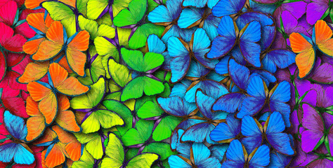
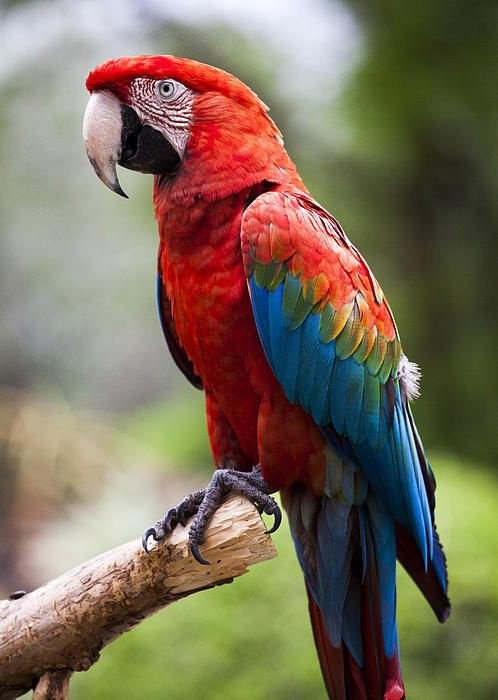
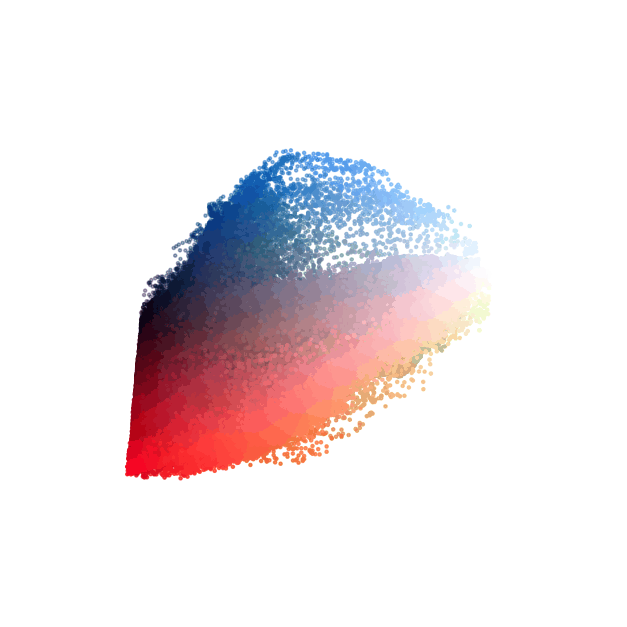
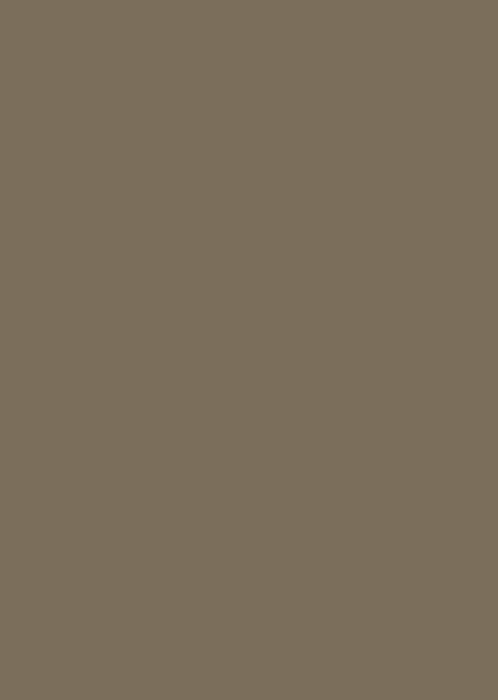
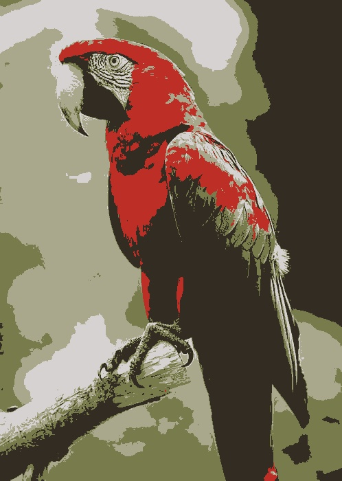
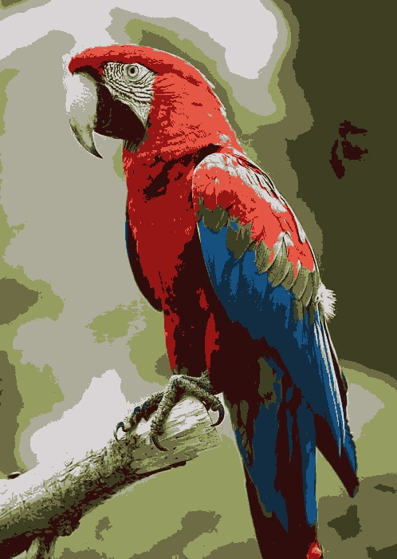
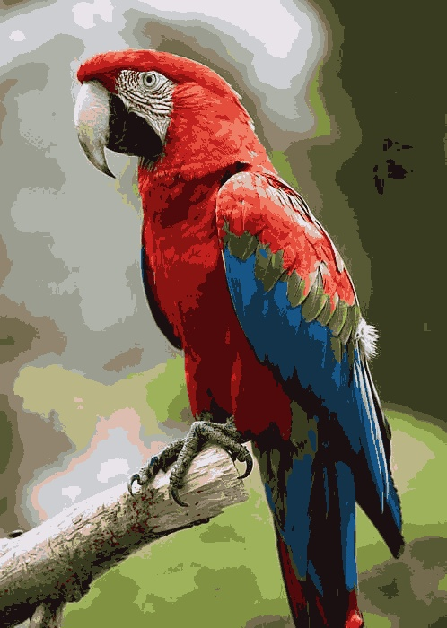
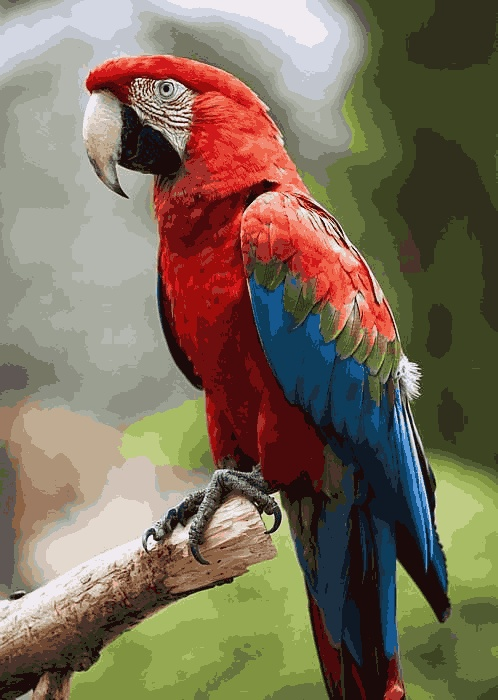
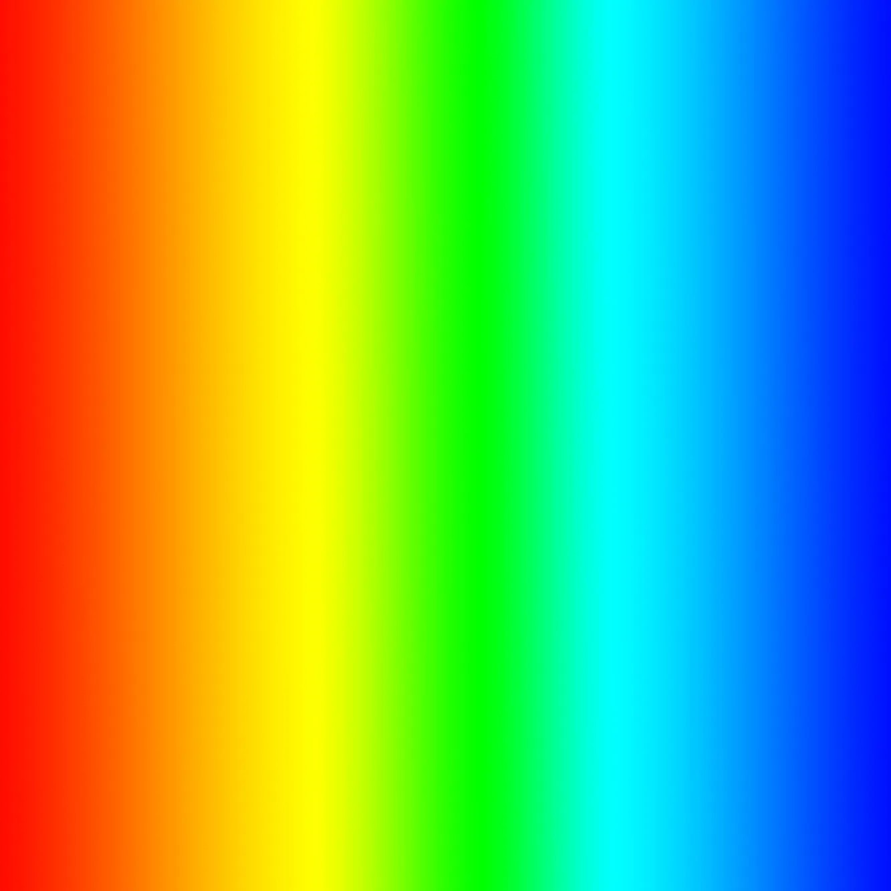
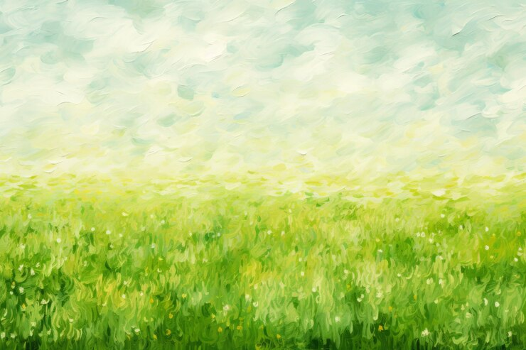

<center>

</center>

## Introduction

This blog quickly demonstrates the Image Quantization (or Color Quantization) image processing technique. The process involves reducing the 
number of distinct colors used in an image using a three-dimensional clustering algorithm. 
Before diving into the why and how, let's briefly discuss what a digital image is.

## What is a digital Image

A digital image is typically composed of **W**idth x **H**eight pixels. In color images using the 24-bit RGB (Red, Green Blue) color format 
each pixel is represented by three integer values ranging from 0 to 255, corresponding to the intensity of each color channel. This format allow
for a total of 2<sup>8</sup> possible values per channel, resulting in 256<sup>3</sup> (16,777,216) potential colors.

<style>
	.image-container {
		display: flex;
		justify-content: center;
		align-items: center;
	}
	.image-container img {
		max-width: 50%;
		height: auto;
		margin: 10px;
	}
</style>

<center>Picture of a colorful parrot and the RGB colors:</center>

<div class="image-container">
	
	
</div>

## Why?

So why quantization? One of the biggest application of image quantization is to optimizes memory usage by reducing the complexity of color data
while maintaining sufficient visual information fo many practical purposes. This reduction in color information not only conserves memory but also
enhances the efficiency of subsequent compression techniques.

And it is fun.

## How?

Image quantization involves clustering similar pixel colors into groups and assigning pixels to representative cluster colors (such as average, median, min, max etc.).
Since we are doing clustering, we can leverage one of the well known unsupervised learning clustering algorithm, the K-Means (note that the algorithm becomes computationally intensive with large images).

The goal is to define a set number of color clusters (K) from the image, where each pixel in the original image is then assigned the mean color value of the cluster it belongs to.
This process ensures that similar pixels are reassigned to similar color values.

<details>
  <summary><u>Click me to see the K-Mean implementation in Python:</u></summary>
  
```python
import cv2
import numpy as np
import matplotlib.pyplot as plt

def find_palette(img, n_colors=10):
    """
    Returns the n colors palettes from image

    Args:
        img (numpy.ndarray): Input image.
        n_colors (int): Number of color palettes to return.

    Returns:
        labels (numpy.ndarray): Array contains the cluster index for each pixel 
        palette (umpy.ndarray): Array of RGB `n_colors` values of the color clusters
    """
    pixels = img.reshape(-1, 3)
    criteria = (cv2.TERM_CRITERIA_EPS + cv2.TERM_CRITERIA_MAX_ITER, 200, 0.1)
    ret, labels, palette = cv2.kmeans(
        np.float32(pixels), n_colors, None, criteria, 10, cv2.KMEANS_RANDOM_CENTERS
    )
    return labels, palette

# Input image
img = cv2.imread(r"parrot.jpg")
#quantize image using 14 color clusters
labels, palette = find_palette(img, n_colors=14)
#reassign image pixel using cluster average
img_quant = palette[labels.flatten()].reshape(img.shape).astype(np.uint8)
#display image
plt.imshow(img_quant[:,:,::-1])
plt.axis('off');
```
</details>

## Results

<div class="image-container">
	
	
	
	
	
</div>

Above are the results using clusters of sizes 1, 5, 10, 20 and 40. With a cluster size of 1, the result is essentially the 
average pixel color value of the entire image. As the number of clusters increases, it looks more like the original image already.

With smaller clusters, the image appears "patchy" and exhibits a gradient effect between the color clusters.
This occurs because fewer colors representing the image, resulting in loss of color transitions and fine details.

Here are more examples with increasing the number of clusters:

Rainbows (up to 40 clusters):
<div class="image-container">
	
	
</div>

Starry Night (up to 25 clusters):
<div class="image-container">
	
	
</div>

Green Field (up to 25 clusters):
<div class="image-container">
	
	
</div>
