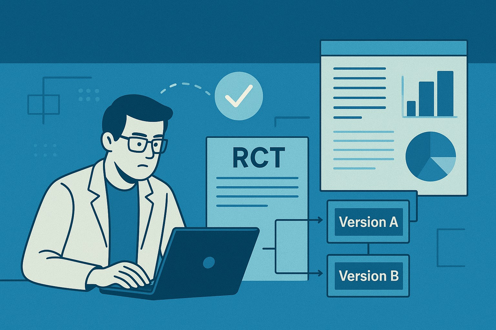

<center>

</center>
<figcaption align="center">Image Generated by ChatGPT-5</figcaption>

## Introduction

**Randomized Controlled Trials (RCTs)** form the bedrock of causal inference across medicine, social science, and product development. At its core, an RCT is a rigorous method designed to establish a cause-and-effect relationship between an intervention (the treatment) and an outcome (the metric) by eliminating confounding variables.

<blockquote>
<strong>Confounding variables</strong> are factors that are related to both the treatment and the outcome, making it seem like there's a direct link between the two when, in fact, the third variable is responsible. For instance, if you're testing a new advertising campaign (treatment) and observe an increase in sales (outcome), but you simultaneously ran the campaign during a holiday season (confounding variable), it would be hard to discern if the sales increase was due to the ad campaign or the holidays. Randomization is designed to distribute these known and unknown confounders equally across groups.
</blockquote>

The power of the RCT lies in **randomization**, which theoretically ensures that the treatment and control groups are identical in every way except for the treatment itself. This foundational principle, however, becomes significantly more complex when applied to dynamic, interconnected systems like online marketplaces and platforms.

## 1. The Core Concept and Classical Design: A/B Testing

**The Principle of Causality**

A standard RCT, often implemented as an A/B test in the digital world, divides a population (**sample selection**) into two or more groups:
- **Group A (Control)**: Experiences the existing condition or product baseline.
- **Group B (Treatment)**: Experiences the new intervention (e.g. a new algorithm, a different UI).

The fundamental assumption underpinning this design is the **Stable Unit Treatment Value Assumption (SUTVA)**. Simply put, SUTVA requires that a user’s outcome only depends on their own assignment (A or B), and not on the assignment of any other user.

**Addressing Initial Challenges: Stratification and Bias**

While simple randomization is effective, practical considerations are necessary to maximize power and minimize bias:

| Consideration | Method | How it Addresses Rigor |
| ------------- | ------ | ---------------------- |
| **Bias** (Pre-existing imbalance) | **Stratification** | Randomization occurs within pre-defined strata (subgroups) based on relevant characteristics (e.g. region, usage level). This ensures the groups are balanced on key covariates, increasing **sensitivity** and reducing selection **bias**. | 
| **Power** (Detecting a true effect) | **Power Analysis** | This pre-experiment calculation determines the **minimum sample selection size** needed to detect a statistically significant effect of a given magnitude (effect size) with a specified probability (power, typically 80% or 90%) and a specified Type I error rate (α, typically 0.05). A well-designed sample ensures high **power** (low False Negatives). | 

**The Randomization Trilemma**

The choice of randomization unit often involves a trade-off between three competing goals (Address Network Effects, Maximize Learning Effects and Power):

| Randomization Method | Network Effects | Learning Effects | Power |
| -------------------- | --------------- | ---------------- | ----- |
| **User A/B** | High Interference (Severe) | Yes (High) | High |
| **Switchback (Time-Region)** | Low Interference (Minimal) | No (Short-term only) | Moderate | 
| **Market A/B (Cluster)** | No Interference | Yes (High) | Low |

## 2. Advanced Designs for Interconnected Systems

In complex environments, SUTVA is often violated due to **Network Effects** - where the experience of one user is influenced by the decisions or actions of other users who share a common resource or interact. This interference dilutes the measured treatment effect, introducing significant **bias** and reducing **sensitivity**.

**Example of Network Effects**: A social media platform testing a new algorithm for displaying content. If User A is shown more engaging content (treatment), they might spend more time on the platform and interact more, leading their friends (User B and C) to also see more of User A's content and spend more time. If User A and User B are in different experiment groups, User A's treatment effect spills over to User B, **confounding the results**.

To overcome this, specialized randomization techniques are required.

### Switchback Tests: The Temporal Solution

When network effects are localized, the **Switchback** test (randomizing on a time-region unit) offers a solution. It eliminates network effects bias by ensuring all users in a cluster receive the same treatment at the same time. However, it trades this off against capturing long-term behavioral changes or **learning effects** and requires careful modeling of **sequence** effects (temporal correlation).

<blockquote>
<strong>Sequence effect</strong> refers to the bias that arises when the observed outcome in a given period is influenced by the treatment applied in the immediately preceding period. Therefore, the impact of the previous treatment has not fully dissipated before the next treatment period begins (Residual / Carryover Effect).
</blockquote>

| Design Feature | Description | Rigor Addressed |
| -------------- | ----------- | --------------- |
| Randomization Unit | Randomization is shifted from the individual user to a **time-region unit** (e.g. all users in a specific city for a 30-minute period). | Eliminates network effects (interference **bias**) by ensuring all users in a cluster receive the same treatment at the same time. |
| Sequence | The algorithm switches back and forth between treatment and control over time within the same region. | Mitigates confounding variables (e.g. day-of-week effects, long-term trends) by comparing time periods immediately following each other. However, this introduces potential **sequence effects** (temporal correlation) that must be accounted for in analysis. |

<blockquote>
<strong>Trade-Off</strong>: Switchback tests are generally unable to capture long-term behavioral changes or learning effects (e.g. customer long-term retention) because the treatment is constantly changing.
</blockquote>

### Market A/B and Quasi-Experimental Methods

For large-scale changes capturing **learning effects**, the **Market A/B** test randomizes entire clusters. Since the sample size is small, this design has low **power** and is vulnerable to pre-existing **bias**.

| Methodology | Application | Rigor Addressed |
| ----------- | ----------- | --------------- |
| **Difference-in-Difference (DiD)** | Analysis used for Market A/B tests. It calculates the change in outcome over time for the treatment group minus the change in outcome over time for the control group. | Reduces pre-existing trend bias by controlling for unobserved factors that change linearly over time (**parallel trend assumption**). |
| **Regression Discontinuity Design (RDD)** |	Used when treatment is assigned based on a threshold on a continuous variable (the running variable). | High internal validity for estimating the local treatment effect around the cutoff, mimicking randomization near the discontinuity. |
| **Propensity Score Matching (PSM)** | Used in observational studies or failed RCTs. It estimates the probability of receiving treatment (propensity score) and matches treated individuals to control individuals with similar scores. | Reduces **selection bias** by balancing observed confounding variables, simulating randomization post-hoc. |

### Beyond the Average: Heterogeneous Treatment Effects (HTE)

Standard RCT analysis focuses on the **Average Treatment Effect (ATE)**. **Heterogeneous Treatment Effects (HTE)** analysis goes further by investigating whether the treatment works differently for specific subgroups (e.g. is the effect stronger for users who joined last month?). Modeling HTE is crucial for maximizing long-term business value through personalization.

## 3. Rigorous Statistical Analysis: Testing and Modeling

Traditional statistical tests (like the t-test) fail when data has a **nested** or **clustered structure** (e.g. Switchback, Market A/B), as they assume independent observations (i.i.d.). This leads to an underestimated variance and an inflated False Positive Rate (analytical bias).

**Simpson's Paradox: The Reversal of Association**

**Simpson's Paradox** is a potent reminder of the dangers of inappropriate aggregation. It occurs when a trend or association observed within several separate groups disappears or **reverses** when those groups are combined. This paradox is triggered when a **powerful confounding variable** (the omitted subgroup indicator) is correlated with both the treatment and the outcome and is unevenly distributed across the aggregated groups. The failure to stratify the analysis results in a misleading or completely backward conclusion about the overall effect.

**The Danger of Ignoring Clustering**

If clustering is ignored, the standard error of the estimate is incorrectly calculated (underestimated). This results in an **inflated T-statistic** and an artificially **low p-value**, leading to a **high False Positive Rate** (Type I error, or incorrectly concluding an effect exists when it doesn't). This represents a serious analytical **bias**.

**Correcting for Multiple Comparisons**

When running an experiment that tracks multiple metrics or involves A/B/N testing, there is a high risk of finding a false positive purely by chance - Multiple Testing Correction is required. Methods like Bonferroni or False Discovery Rate (FDR) are used to adjust the statistical thresholds and control the overall error rate.

**Variance Reduction and Precision**

To increase the **sensitivity** and **power** of the experiment without increasing duration, statistical control methods are employed:

| Method | Concept | Rigor Addressed |
| ------ | ------- | --------------- |
| **CUPED (Control Using Pre-experiment Data)** | Uses pre-experiment data (e.g. baseline user activity) as a covariate in the analysis model. |	Substantially reduces the variance of the metric, dramatically increasing power and reducing the required run time. | 
**Covariance Adjustment (ANCOVA)** | Similar to CUPED, it includes continuous covariates into the regression model. | Reduces the unexplained variance in the outcome metric, thereby increasing power and precision of the treatment effect estimate. |

### The Solution: Regression Analysis and Multilevel Models

For clustered data, regression models are necessary to ensure unbiased variance estimation:

1. **Cluster-Robust Standard Errors (CRSE)**: Common method for handling clustering. Instead of assuming independence, CRSE (often implemented using a **Sandwich Estimator of Variance**) adjusts the standard errors based on the variation between the clusters (the randomization unit), correcting for the correlation within the clusters.

2. **Mixed-Effect Models (Multilevel Models / MLM)**: The optimal solution for analyzing data from designs like Switchbacks.
    - MLM explicitly models both Fixed Effects (the treatment) and Random Effects (the unit-level variation).
    - By incorporating individual observations while correctly partitioning the variance into *within-cluster* and *between-cluster* components, MLM provides a more precise estimate of the treatment effect. This allows the analysis to leverage the larger sample size of individual observations, significantly increasing **statistical power** (reducing false negatives) and ensuring the variance estimate is unbiased, leading to a low false positive rate.
    - It uses the Intraclass Correlation Coefficient (ICC) to measure the proportion of total variance explained by the clustering, indicating the necessity of the MLM structure (i.e. High ICC). By correctly partitioning the variance, MLM significantly increases statistical power and eliminates the false positive bias from non-independence.

### Alternative Analytical Frameworks
- **Bayesian Hypothesis Testing**: Provides an alternative to the frequentist p-value. Instead of testing for significance, it calculates the **probability** that the treatment is superior to the control, offering a decision-making metric based on certainty.

### Addressing Real-World Non-Compliance

In real-world RCTs, not every assigned participant adheres to their assigned treatment (**non-compliance**).

- **Intent-to-Treat (ITT) Analysis**: Analyzes results based on **original random assignment**, regardless of actual treatment received. This preserves randomization benefits, avoids **selection bias**, and provides a conservative estimate of the real-world effect.

- **Per-Protocol (PP) Analysis**: Analyzes only those who completed the intervention as intended. This introduces **selection bias** but provides an estimate of the maximum efficacy under ideal adherence.

### Inference When Randomization Fails

If randomization is impossible or completely compromised due to deep, unobserved confounding variables, specialized techniques are needed:

- **Instrumental Variables (IV)**: Used when there is an unobserved confounding variable influencing both the treatment and the outcome. IV requires finding an external variable (the "instrument") that is related to the treatment but affects the outcome only through the treatment. It helps establish causal effects in challenging observational settings.

## 4. Experiment Design Flowchart

```
START
 └─ Can you randomly assign treatment to units (e.g., users, markets)?
     ├─ YES → Step 2
     │         - Randomization controls for confounding
     └─ NO  → Step 4 (Quasi-Experimental Methods)
               - Must address bias due to non-random assignment

------------------------------------------------------------
Step 2: Is there risk of Network Interference (Violation of SUTVA)?
------------------------------------------------------------
     ├─ NO → Standard A/B Test (User-Level)
     │         - Maximizes statistical power
     │         - Captures learning and behavior change at the individual level
     │
     └─ YES → Step 3
               - Must avoid interference bias between units
               - Users may affect one another (spillover, cross-market learning)

------------------------------------------------------------
Step 3: Do we need to measure Long-Term Learning Effects?
------------------------------------------------------------
     ├─ NO → Switchback Test (Time x Region / Time x Unit)
     │         Trade-offs:
     │         - Controls interference by rotating treatment over time
     │         - Does not capture true long-term behavior change
     │         - Can suffer from sequence/carryover effects
     │
     │         Analytical Solution:
     │         - Use Multi-Level Models (MLM)
     │             * Corrects clustering and repeated measures
     │             * Reduces bias from sequence effects
     │
     └─ YES → Cluster / Market A/B Test (Geo-level or large unit randomization)
               Trade-offs:
               - Handles network interference by assigning treatment at large unit level
               - Lower power due to fewer units
               - Higher risk of baseline imbalance

               Analytical Solution:
               - Use Difference-in-Difference (DiD)
                   * Controls for pre-existing trend and baseline differences
                   * Improves causal validity even with few clusters

------------------------------------------------------------
Step 4: Quasi-Experimental Methods (When Randomization is Impossible)
------------------------------------------------------------
     ├─ Step 4A – Assignment based on a threshold (score, metric)?
     │         → Regression Discontinuity Design (RDD)
     │             * Assumes units just above/below threshold are comparable
     │             * Improves internal validity despite non-random assignment
     │
     ├─ Step 4B – Unobserved confounders affect treatment selection?
     │         → Instrumental Variables (IV)
     │             * Uses an external factor that influences treatment
     │               but does NOT affect the outcome directly
     │             * Allows unbiased causal estimation with unobserved confounding
     │
     └─ Step 4C – Groups differ on observed characteristics?
               → Propensity Score Matching (PSM)
                   * Matches units with similar likelihood of receiving treatment
                   * Mitigates observed selection bias
                   * Does NOT correct unobserved confounding

------------------------------------------------------------
Universal Analytical Solutions (Use with ANY Design)
------------------------------------------------------------
Applicable whether randomized, clustered, sequential, or quasi-experimental.

     - CUPED / ANCOVA
         * Reduces variance using pre-experiment covariates
         * Increases sensitivity and statistical power

     - Multiple Testing Corrections
         * Controls inflation of Type I error when many metrics are tested

     - ITT (Intention-To-Treat) Analysis
         * Preserves original randomization
         * Eliminates selection bias from non-compliance or partial adoption

     - Avoid Naïve Aggregation
         * Prevents incorrect conclusions from pooled subgroup analysis
         * Avoids Simpson’s Paradox

```

## References

**DoorDash**
- [Switchback Tests and Randomized Experimentation Under Network Effects at DoorDash](https://careersatdoordash.com/blog/switchback-tests-and-randomized-experimentation-under-network-effects-at-doordash/)
- [Balancing Network Effects Learning Effects and Power in Experiments](https://careersatdoordash.com/blog/balancing-network-effects-learning-effects-and-power-in-experiments/)
- [Experiment Rigor for Switchback Experiment Analysis](https://careersatdoordash.com/blog/experiment-rigor-for-switchback-experiment-analysis/)
- [Cluster Robust Standard Error in Switchback Experiments](https://careersatdoordash.com/blog/cluster-robust-standard-error-in-switchback-experiments/)

**Airbnb**
- [Experiments at Airbnb](https://medium.com/airbnb-engineering/experiments-at-airbnb-e2db3abf39e7)

**Lyft**
- [Experimentation in a Ridesharing Marketplace](https://eng.lyft.com/experimentation-in-a-ridesharing-marketplace-b39db027a66e#.hofgv4rx4)
- [Simulating a Ridesharing Marketplace](https://eng.lyft.com/https-medium-com-adamgreenhall-simulating-a-ridesharing-marketplace-36007a8a31f2#.g9b34i3gm)
- [Matchmaking in Lyft line](https://eng.lyft.com/matchmaking-in-lyft-line-part-3-d8f9497c0e51)

**General**
- [How not to run an AB Test](https://www.evanmiller.org/how-not-to-run-an-ab-test.html)


