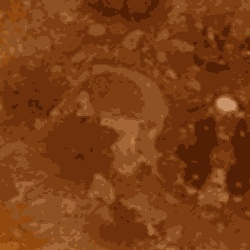

<figcaption align="center">Picture taken at Honolulu, HI, USA in Apr, 2024 © Steven Lio</figcaption>

---

<style>
* {
  box-sizing: border-box;
}
.column {
  float: left;
  width: 50%;
  padding: 0px;
}
.row::after {
  content: "";
  clear: both;
  display: table;
}
img {
  display: block;
  margin-left: auto;
  margin-right: auto;
}
</style>

## Introduction

The primary objective of this project is to create image mask accurately to hightlight the areas of baby corals growth from images of coral plugs. 
This will aid in the research of understanding growth patterns of baby corals, collect data on various parameters such as the size, dry weight, and growth / mortality rates in baby corals
to evaluate the effectiveness of some treatments designed to enhance coral growth.

Coral protection is essential for maintaining biodiversity in the marine ecosystems and significantly impacts global food production.

Having visited Honolulu, HI many times, I personally witnessed the devastating impact of ocean warming on coral bleaching and the consequent decline in marine life diversity.

## Background

**Image Segmentation**<sup>[1](https://en.wikipedia.org/wiki/Image_segmentation)</sup> is a well-studied topic in computer visions research long before the advancement in modern-days GPUs technology (notably Nvidia) 
that have enabled the development and application of more complex algorithms, such as **Convolution Neural Networks (CNNs)**<sup>[2](https://en.wikipedia.org/wiki/Convolutional_neural_network)</sup> for computer vision tasks.

However, developing and training a CNN is very costly, and more importantly, requires a significant amount of representative training data to achieve accurate and reliable results.

For this project, I used an image set of coral plugs (total 130 images), consisting of top-down views of various individual circular coral plugs.
*Due to confidentiality, I cannot disclose the data source.*

However, I can show you an example of the images I used:

<div class="row">
  <div class="column">
    <figcaption align="center">Image example</figcaption>
	
  </div>
  <div class="column">
  	<figcaption align="center">Coral baby (Middle)</figcaption>
	
  </div>
</div>

## Preprocessing Images

The coral plug images were captured from a systems that was calibrated to centered the coral plugs in the image. However, there are 
variances where some are not as centered. The images captured were also from the same distance, each coral plug will appears to be nearly identical in size.

The images were first preprocessed by centering them and cropping the key area (i.e. coral plug) to ensure when developing an algorithm, the machine learning algorithm focuses only on the coral plug, minimizing distractions.

To achieve this, I used the **Hough Circle Transform**<sup>[3](https://docs.opencv.org/3.4/d4/d70/tutorial_hough_circle.html)</sup> algorithm which is specifically designed for detecting "circles" in an image.
This is ideal for my images as it helps locate the coral plug, find its center and crop out the excess areas.

<details>
  <summary><u>Click me to see the implementation in Python:</u></summary>

```python
# OpenCV library
import cv2

# Path for image and output folder
img_path = r"coral.jpg"
out_path = r"out_folder"

# Read image and resize to 512 x 512
img = cv2.imread(img_path)
img = cv2.resize(img, (512, 512))

# Create a copy of the original image and a gray scale version of the image
output = img.copy()
gray = cv2.cvtColor(output, cv2.COLOR_BGR2GRAY)
gray = cv2.medianBlur(gray, 5)

# Padding the correct circle
padding = 8

# Find Hough Circles
circles = cv2.HoughCircles(
    gray,
    cv2.HOUGH_GRADIENT,
    dp=1.2,
    minDist=120,
    param1=100,
    param2=30,
    minRadius=120,
    maxRadius=180,
)

# Draw Hough Circles
try:
    circles = np.round(circles[0, :]).astype("int")
    for (x, y, r) in circles:
        if 200 < x < 250 and 200 < y < 250:
            cv2.circle(output, (x, y), r + padding, (0, 255, 0), 4)
            print(x, y, r)
        else:
            cv2.circle(output, (x, y), r, (0, 0, 255), 2)
except:
    print("No circles is found! Check Hough Circle parameters.")

# Save the final output to folder
cv2.imwrite("{0}\{1}".format(out_path, "houghcircles.jpg"), output)
```
</details>

The output after applying Hough Circle Transform:


In the output image, correctly detected circles are marked in green, while incorrect ones are in red. 
Knowing the size of the image and the coral plug's scale allowed me to constrain the Hough Circle algorithm to a specific radius range and focus on the center of the image.
After identifying the key area, I cropped out this region and create a black mask to cover the remaining areas outside of the coral plug.

<details>
  <summary><u>Click me to see the final implementation in Python:</u></summary>

```python
def find_plug(img, padding=5, create_mask=True, out_size=(512, 512)):
    """
    Find Coral Plug in image using Hough Circle.

    Args:
        img (numpy.ndarray): Input image containing coral plug.
        padding (int): Padding for the correct circle.
        create_mask (bool): Create a mask as the output.
        out_size (tuple): Output image size.

    Returns:
        int: The product of a and b.
    """

    # Gray scaling image
    gray = cv2.cvtColor(img, cv2.COLOR_BGR2GRAY)
    gray = cv2.medianBlur(gray, 5)

    # Define Hough Circles with hyper-parameters
    circles = cv2.HoughCircles(
        gray,
        cv2.HOUGH_GRADIENT,
        dp=1.2,
        minDist=120,
        param1=100,
        param2=30,
        minRadius=120,
        maxRadius=180,
    )

    # Find the correct circle
    if circles is not None:
        circles = np.round(circles[0, :]).astype("int")
        for (x, y, r) in circles:
            if 200 < x < 250 and 200 < y < 250:
                r += padding
                break
            else:
                x, y, r = img.shape[0] // 2, img.shape[1] // 2, 80
                break

    # Create the square cropping area based on the found circle
    cropped_image = img[y - r : y + r, x - r : x + r]

    # Mask out the areas outside of the circle
    if create_mask:
        mask = np.zeros_like(cropped_image)
        center = cropped_image.shape[0] // 2
        cv2.circle(mask, (center, center), r + padding, (255, 255, 255), thickness=-1)
        cropped_image = cv2.bitwise_and(cropped_image, mask)

    cropped_image_resized = cv2.resize(cropped_image, out_size)
    return cropped_image_resized
```
</details>

Here is an example of the complete preprocessing applied to each image:


<figcaption align="center"></figcaption>

## Naive Approach
Before implementing a more sophisticated model/algorithm, I want to explore a simple and naive method to see how far it can takes me. This is usualy a rule of thumb for all the projects I've worked on.

The naive method I used is called **Thresholding**<sup>[4](https://en.wikipedia.org/wiki/Thresholding_(image_processing))</sup>. It is commonly used in digital image processing.

Despite its simplicity, this method can be very effective for certain types of images without needing any advanced machine learning, in example like images captured in other spectrums (e.g. IR, UV) or images captured using a fluorescence cameras (\\$\\$\\$) which is very effective for highlighting organic materials
from its surrounding.


<figcaption align="center">Example of Fluorescent Imaging of cancer cells<sup>5</sup></figcaption>


However, I will be working with regular RGB colored images of coral plugs, also using images captured in other light spectrum may not be as effective on coral plugs.
Since there are other creatures like algaes, baby sea anenemon also growing on the coral plug and those may easily being falsly identified.

Here is the naive approach:

1. Find color pixel value range of the coral babies using k-mean on the pixel values to identify the dominant color palettes in RGB of the corals this process is also known as Quantization<sup>[6](https://en.wikipedia.org/wiki/Quantization_(image_processing))</sup>.

<div class="row">
  <div class="column">
  	<figcaption align="center">Before Quantization</figcaption>
	

  </div>
  <div class="column">
  	<figcaption align="center">After Quantization</figcaption>
	
  </div>
</div>

Here I found 10 dominant colors for the coral babies.


2. Fine tuning Thresholding on each of the dominant color clusters range identified in k-mean.

The image below shows how the selected area widens as the value range for each color cluster increases. Blindly expanding these ranges can falsly highlight areas that contains no coral babies:


This concludes the naive approach, it requires lots of fine tuning and very difficult
to generalized especially when dealing with real-world data.

Actually...Isn't green screen exactly this? Instead of creating a mask, we just replace the green pixels with pixels from another images?


<details>
  <summary><u>Click me to see the naive approach in Python:</u></summary>

```python
import cv2
import numpy as np
import glob
import matplotlib.pyplot as plt


def imshow_pair(img1, img2):
    """
    Display pair of images with same height side by side

    Args:
        img1 (numpy.ndarray): left image
        img2 (numpy.ndarray): right image

    returns
    """
    fig, ax = plt.subplots(1, 2)
    ax[0].imshow(img1)
    ax[0].axis("off")
    ax[1].imshow(img2)
    ax[1].axis("off")


def concat_vertical(img_list, interpolation=cv2.INTER_CUBIC):
    """
    Concat images of different sizes vertically.
    Images are resize such that it will match the mininum image width in the image list

    Args:
        img_list (list): List of image to concat.
        interpolation (int): OpenCV interpolation method for resizing

    Returns:
        int: The product of a and b.
    """
    min_width = min(img.shape[1] for img in img_list)
    img_list_resize = [
        cv2.resize(
            img,
            (min_width, int(img.shape[0] * min_width / img.shape[1])),
            interpolation=interpolation,
        )
        for img in img_list
    ]
    return cv2.vconcat(img_list_resize)


def find_palette(img, n_colors=10):
    """
    Returns the n colors palettes from image

    Args:
        img (numpy.ndarray): Input image.
        n_colors (int): Number of color palettes to return.

    Returns:
        labels (numpy.ndarray): Array contains the cluster index for each pixel 
        palette (umpy.ndarray): Array of RGB `n_colors` values of the color clusters
		
    """
    pixels = img.reshape(-1, 3)
    criteria = (cv2.TERM_CRITERIA_EPS + cv2.TERM_CRITERIA_MAX_ITER, 200, 0.1)
    ret, labels, palette = cv2.kmeans(
        np.float32(pixels), n_colors, None, criteria, 10, cv2.KMEANS_RANDOM_CENTERS
    )
    #_, counts = np.unique(labels, return_counts=True)
    #palette = palette[np.argsort(counts)[::-1]]

    return labels, palette


def create_mask(img, palette, pixel_range_window=5):
    """
    Create mask from image based on palette information

    Args:
        img (numpy.ndarray): Input image.
        palette (numpy.ndarray): Color palette values.
        pixel_range_window (int): width of the color range for each palette value

    Returns:
        coral_withMask (numpy.ndarray): The original coral image
    """
    new_img_blur = cv2.GaussianBlur(img, (15, 15), 0)
    new_img_flat = cv2.cvtColor(new_img_blur, cv2.COLOR_BGR2HSV).reshape((-1, 3))
    mask = np.uint8(np.zeros(new_img_blur.shape[:2]))

    for i in range(len(palette)):
        lower = palette[i] - pixel_range_window
        upper = palette[i] + pixel_range_window
        mask = cv2.bitwise_or(mask, cv2.inRange(new_img_blur, lower, upper))

    no_coral = cv2.bitwise_and(img, img, mask=cv2.bitwise_not(mask))
    coral = cv2.bitwise_and(img, img, mask=mask)
    coral_withMask = cv2.addWeighted(no_coral, 0.3, coral, 1.5, 0.0)

    return coral_withMask, mask


# import image references of manually selected coral regions
references = glob.glob(r"coral_references\*.jpg")

# stitch all references into one for analysis
stitched_references = cv2.resize(
    cv2.imread(references[0]), (256, 256), interpolation=cv2.INTER_CUBIC
)
for i in references[1:]:
    stitched_references = concat_vertical(
        [
            stitched_references,
            cv2.resize(cv2.imread(i), (256, 256), interpolation=cv2.INTER_CUBIC),
        ]
    )

# Using k-means to find palettes:
labels, palette = find_palette(stitched_references, n_colors=10)

# Create mask on image:
img_path = r"img.jpg"
img = cv2.imread(img_path)

coral_withMask, coral_mask = create_mask(img, palette, pixel_range_window=12)

imshow_pair(
    cv2.cvtColor(coral_withMask, cv2.COLOR_BGR2RGB),
    cv2.cvtColor(coral_mask, cv2.COLOR_BGR2RGB),
)
```
</details>

## Convolution Neural Network

Convolution Neural Network is popular in solving computer vision tasks, I chose the **U-Net**<sup>[7](https://en.wikipedia.org/wiki/U-Net)</sup> architecture from the **Convolution Neural Networks**<sup>[2](https://en.wikipedia.org/wiki/Convolutional_neural_network)</sup> architures family.
It is well known for its proven sucess in solving image segmentation problems and its ablility to trained efficiently to produce remarkable results for image segmentation.

Since I didn't have a existing mask for each coral plug image, I manually created them for each image. These masks highlight the areas where the coral babies are located on the coral plug.
The objective of the Neural Network is to use these image-mask pairs to train and accurately generate masks for new images of coral plugs.

The U-Net training process follows the standard Neural Network training procedures: spliting images into training, validation and test sets to assess model's performance,
defining loss function, optimizer and approporiate evaluation metrics to monitor model outputs during training, applied early stopping to control overfitting, and evaluating the best model on unseen images.

## Transfer Learning

I've opted to use the U-Net architecture with a ResNet<sup>[8](https://en.wikipedia.org/wiki/Residual_neural_network)</sup> encoder backbone and begin with pre-trained weights from the ImageNet<sup>[9](https://en.wikipedia.org/wiki/ImageNet)</sup> project.
This approach allows me to leverage transfer learning from a more sophisticated model that has been exposed to extensive image data, rather than developing an entirely new architecture from scratch.
Additionally, given that I only have an Nvidia RTX 2060 with 6GB GPU, training a larger model from the ground up isn't feasible.

## Model Configs

* Image size: **256x256**
* Batch size: **32**
* Epoch<sup>[10](https://en.wikipedia.org/wiki/Epoch_(computing))</sup>: **500** (With Early Stopping<sup>[11](https://en.wikipedia.org/wiki/Early_stopping))</sup>)
* Loss Criteria<sup>[12](https://en.wikipedia.org/wiki/Loss_function)</sup>: **Jaccard Loss**<sup>[13](https://en.wikipedia.org/wiki/Jaccard_index)</sup> ~ *IoU*<sup>[14]()</sup>
* Activation Function<sup>[15](https://en.wikipedia.org/wiki/Activation_function)</sup>: **Sigmoid**
* Optimizer<sup>[16](https://en.wikipedia.org/wiki/Stochastic_optimization)</sup>: **Adam**<sup>[17](https://en.wikipedia.org/wiki/Stochastic_gradient_descent#Adam)</sup>
* Learning Rate<sup>[18](https://en.wikipedia.org/wiki/Learning_rate)</sup>: **0.001**

## Results

The training process early stopped after only **83** epochs to avoid overfitting.

In terms of metrics, the model demostrated great success in learning and generating accurate masks for the training data. 
However, its performance on unseen images (validation) wasn't optimal, although still quite satisfactory.

<div>

</div>

Key takeaways: the best-performing model achieved a **69.9%** Intersection over Union (IoU)<sup>[14](https://en.wikipedia.org/?title=Intersection_over_union&redirect=no)</sup> score and an **78.9%** recall rate.

Upon analyzing the performance metrics, there's a noticeable divergence between the validation images (unseen during training) and the training images.
This indicates that the model is susceptible to overfitting, especially given the limited amount of images available which results in a small validation set - typically associated with higher variance.
Also, the validation set may include specific cases that were not represented in the training data.

Some prediction results on unseen images:


<figcaption align="center">Predict on test image - IoU (74.1%); Left to right: Coral Plug, True Mask, Predicted Mask</figcaption>


<figcaption align="center">Predict on image without preprocessing; Coral Plug vs Predicted Mask</figcaption>


<figcaption align="center">Predict on Lenna</figcaption>

## What I've learned

I've gained significant insights and hands-on experience developing a Neural Network for image segmentation on real-world images. 
There are many other things to explore for improving the model such as fine tuning trainin parameters, trying different CNN architecture,
finding larger datasets and refining the true masks so the model will learn precisely what a baby coral is.

## References

Here is the Jupyter notebook on the model building process.


Notebook


<sup>1</sup>[Image Segmentation](https://en.wikipedia.org/wiki/Image_segmentation)
<sup>2</sup>[Convolutional Neural Network](https://en.wikipedia.org/wiki/Convolutional_neural_network)
<sup>3</sup>[Hough Circle Transform](https://docs.opencv.org/3.4/d4/d70/tutorial_hough_circle.html)
<sup>4</sup>[Thresholding](https://en.wikipedia.org/wiki/Thresholding_(image_processing))
<sup>5</sup>[Credit: Nicola Ferrari @iStock](https://www.istockphoto.com/photo/fluorescent-imaging-immunofluorescence-of-cancer-cells-growing-in-2d-with-nuclei-in-gm1184711342-333614737)
<sup>6</sup>[Quantization](https://en.wikipedia.org/wiki/Quantization_(image_processing))
<sup>7</sup>[U-Net](https://en.wikipedia.org/wiki/U-Net)
<sup>8</sup>[Resnet](https://en.wikipedia.org/wiki/Residual_neural_network)
<sup>9</sup>[ImageNet](https://en.wikipedia.org/wiki/ImageNet)
<sup>10</sup>[Epoch](https://en.wikipedia.org/wiki/Epoch_(computing))
<sup>11</sup>[Early Stopping](https://en.wikipedia.org/wiki/Early_stopping)
<sup>12</sup>[Loss Criteria](https://en.wikipedia.org/wiki/Loss_function)
<sup>13</sup>[Jaccard Loss](https://en.wikipedia.org/wiki/Jaccard_index)
<sup>14</sup>[IoU](https://en.wikipedia.org/?title=Intersection_over_union&redirect=no)
<sup>15</sup>[Activation Function](https://en.wikipedia.org/wiki/Activation_function)
<sup>16</sup>[Optimizer](https://en.wikipedia.org/wiki/Stochastic_optimization)
<sup>17</sup>[Adam](https://en.wikipedia.org/wiki/Stochastic_gradient_descent#Adam)
<sup>18</sup>[Learning Rate](https://en.wikipedia.org/wiki/Learning_rate)


