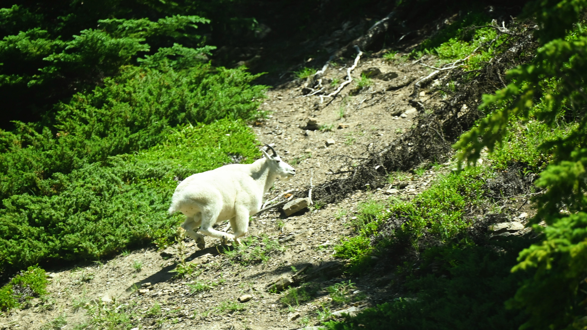

<figcaption align="center">Mountain Goats at Banff, AB, Canada in Aug, 2022 © Steven Lio</figcaption>

---

<h2 align="center">Upload an image and I will tell you it is Upgoat or Downgoat!</h2>

<script src="https://cdn.jsdelivr.net/npm/onnxruntime-web/dist/ort.min.js"></script>
<script src="https://cdn.jsdelivr.net/npm/onnxjs/dist/onnx.min.js"></script>

<script src="js/goat.js"></script>

<center>
<input type="file" id="image-upload" accept="image/*" style="display: block; margin: 0 auto 20px;">
<button class="inline-block !rounded-md bg-primary-600 px-4 py-1 !text-neutral !no-underline hover:!bg-primary-500 dark:bg-primary-700 dark:hover:!bg-primary-500" onclick="predictImage()">Go Predict!</button>

<div id="prediction-result" style="margin-top: 20px;"></div>
</center>

---

## Introduction

Inspired by the challenged posed on StackExchange titled [Upgoat or Downgoat?](https://codegolf.stackexchange.com/questions/71631/upgoat-or-downgoat). 
The challenge originally asked participants to create a program to determine if an image of a goat is upside down, or not.

This project is not aimed to solve the challenge under its strict conditions, my focus on this project is to deploy a pre-trained Neural Network and make
predictions directly in the browser. This project will involve training a Neural Network to solve the Upgoat or Downgoat? problem using Tensorflow, then convert 
to ONNX model format and implement JavaScript to handle the uploaded image processing and make prediction using the Neural Network.

## Process

### 1. Image Data

I've started with 3,262 images that contains goats from various sources<sup>1</sup>. Then I've compile all the images and remove duplicates images.
Some of these images contains more than one goat or it is a partial of a goat. To create the training datasets, I've first used the famous YOLOv3<sup>[2](https://arxiv.org/abs/1804.02767)</sup> to
find all goats from the images and cropped out the regions that containing the goats, then output image of each goat found in the images resulting
3,473 images containing at most one/partial of a goat.

To build the final training datasets, I've randomly split the images into 80% for training, 15% for validation and 5% for testing. Then for each batch
randomly rotate half of them upside down to create the images of "downgoats".

<details>
  <summary><u>Click me to see the YOLO implementation in Python:</u></summary>

```python
import cv2
import numpy as np
import matplotlib.pyplot as plt

# Load YOLO
yolo_version = "yolov3"
net = cv2.dnn.readNet(f"model/{yolo_version}.weights", f"model/{yolo_version}.cfg")
layer_names = net.getLayerNames()
output_layers = [layer_names[i - 1] for i in net.getUnconnectedOutLayers()]

# Load class names
with open("model/coco.names", "r") as f:
    classes = [line.strip() for line in f.readlines()]


def YOLO(yolo, img):
    """
    Use YOLO to find all identified objects from image.

    Args:
        yolo (cv2.dnn.Net): YOLO model object.
        img (np.ndarray): Image array object.

    Outpus:
        class_ids (list): COCO class ids for the objects label
        confidences (list): Confidences levels of the detected object
        boxes (list): Bounding box for the detected objects
        indices (list): Indices of the bounding boxes kept after NMS.

    """
    # Prepare the image for YOLO
    blob = cv2.dnn.blobFromImage(
        img,
        scalefactor=0.00392,
        size=(416, 416),
        mean=(0, 0, 0),
        swapRB=True,
        crop=False,
    )
    yolo.setInput(blob)
    outs = yolo.forward(output_layers)

    # Initialize parameters
    class_ids = []
    confidences = []
    boxes = []

    # Process each detection
    for out in outs:
        for detection in out:
            scores = detection[5:]
            class_id = np.argmax(scores)
            confidence = scores[class_id]
            if confidence > 0.5:
                # Object detected
                center_x = int(detection[0] * img.shape[1])
                center_y = int(detection[1] * img.shape[0])
                w = int(detection[2] * img.shape[1])
                h = int(detection[3] * img.shape[0])
                x = int(center_x - w / 2)
                y = int(center_y - h / 2)
                boxes.append([x, y, w, h])
                confidences.append(float(confidence))
                class_ids.append(class_id)

    # Apply non-max suppression to remove overlapping boxes
    indices = cv2.dnn.NMSBoxes(boxes, confidences, 0.5, 0.4)

    return class_ids, confidences, boxes, indices


def find_objects(
    img, classes_of_interest, class_ids, confidences, boxes, indices, swapRB
):
    """
    Find objects from image given by the YOLO outputs:

    Args:
        img (np.ndarray): Image array object
        classes_of_interest (list): List of Class Id to extract objects base on the COCO classes
        class_ids (list): List of class id of the objects identified by YOLO
        confidences (list): Confidences levels of the detected object
        boxes (list): Bounding box for the detected objects
        indices (list): Indices of the bounding boxes kept after NMS.
        swapRB (bool): For displaying purposes, flip the Red and Blue channel in the image
    Outputs:
        img_out (np.ndarray): Ouput image with object box
        objects (dict): Dictionary of the selected objects and its bounding box
    """
    img_out = img.copy()
    if swapRB:
        img_out = cv2.cvtColor(img_out, cv2.COLOR_BGR2RGB)
    objects = {}
    if isinstance(indices, np.ndarray) and len(indices.shape) == 2:
        indices = indices.flatten()

    for i in indices:
        class_id = class_ids[i]
        class_name = classes[class_id]

        if class_name in classes_of_interest:
            x, y, w, h = boxes[i]
            cv2.rectangle(img_out, (x, y), (x + w, y + h), (0, 255, 0), 2)
            label = f"{class_name}: {confidences[i]:.2f}"
            cv2.putText(
                img_out,
                label,
                (x, y - 10),
                cv2.FONT_HERSHEY_SIMPLEX,
                0.5,
                (0, 255, 0),
                2,
            )

            objects[class_name] = {"id": class_id, "box": (x, y, w, h)}

    return img_out, objects


# Found goats
img = cv2.imread(r"goats.jpg")

class_ids, confidences, boxes, indices = YOLO(net, img)
classes_of_interest = classes[14:24]  # animals

img_out, objects = find_objects(
    img, classes_of_interest, class_ids, confidences, boxes, indices, True
)

plt.imshow(img_out)
plt.axis("off")
```
</details>

Note: YOLOv3 is not trained to identify goat specifcally, however it is good at identify what is goat-like animal (e.g. cow, horse, dog etc) vs. what is not.

### 2. Train Neural Network

I've decided to build the Neural Network using Tensorflow<sup>[3](https://www.tensorflow.org/)</sup> to see how different it is to PyTorch<sup>[4](https://pytorch.org/)</sup>.
Instead of training a new Neural Network, I've transfer learning from the MobileNetV2 to extract images features and create a custom layer
in the final model then train it to identify upgoats vs downgoats.

The resulting model is able to input RGB images of size *128x128* and produce a probability of it being an upgoat (p=1) or downgoat(p=0).
The trained model performed exceptional on validation images where after tuning it achieved **~99.9%** in all metrics and ~0% loss.
This does not mean the model has the ability to determine upgoat vs. downgoat **99.9%** all the time. But it is very good with the images available and to decide if an goat-like
object is right-side-up or up-side-down, and probably still good at determining yours.

Here are the details of the training process:

Notebook



### 3. Convert to ONNX

The final model object *(.h5)* is converted to an ONNX object<sup>[5](https://onnx.ai/)</sup>. It is an open format built to represent machine learning models available in both
Python and JavaScript. 

<details>
  <summary><u>Click me to see the ONNX conversion in Python:</u></summary>

```python
import tensorflow as tf
import tf2onnx
import onnx

# Load the Keras model
loaded_model = tf.keras.models.load_model(r"model/goat.h5")

# Define input layers format
input_signature = [tf.TensorSpec([None, 128, 128, 3], tf.float32, name="input")]
onnx_model, _ = tf2onnx.convert.from_keras(loaded_model, input_signature, opset=13)
onnx.save(onnx_model, r"model/goat.onnx")
```
</details>

## Deployment

The implementation of incorporating an ONNX model in JavaScript is straight forward using the ONNX Runtime library<sup>[6](https://onnxruntime.ai/docs/performance/model-optimizations/ort-format-models.html)</sup>.

<details>
  <summary><u>Click me to see the model implementation in JavaScript:</u></summary>

```javascript
async function loadModel(modelPath) {
    try {
        // Load the ONNX model
        const model = await ort.InferenceSession.create(modelPath);
        return model;
    } catch (error) {
        console.error('Error loading model:', error);
        throw error;
    }
}

const model_path = ... # Path to the model
const model = await loadModel(model_path);
const input = ... # Define the necessary input for your model
const output = await model.run(input);
```
</details>

## Future Improvements

Add YOLO to the app, find if image do contains a goat like subject.


## What I've learned

I've successfully implemented a Neural Network with ONNX as well as training ONNX. Also incorporating YOLO or other similar image classification models for image processing greatly enhanced the ability to create
robust training images for computer vision tasks.

## References

<sup>1</sup> Goat images: [Dataset Ninja](https://datasetninja.com/goat-image-dataset), [Mendeley Data](https://data.mendeley.com/datasets/4skwhnrscr/1), [images.cv](https://images.cv/dataset/goat-image-classification-dataset)
<sup>2</sup>[YOLOv3](https://arxiv.org/abs/1804.02767)
<sup>3</sup>[Tensorflow](https://www.tensorflow.org/)
<sup>4</sup>[PyTorch](https://pytorch.org/)
<sup>5</sup>[Open Neural Network Exchange (ONNX)](https://onnx.ai/)
<sup>6</sup>[ONNX Runtime](https://onnxruntime.ai/docs/performance/model-optimizations/ort-format-models.html)