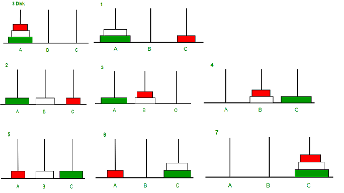
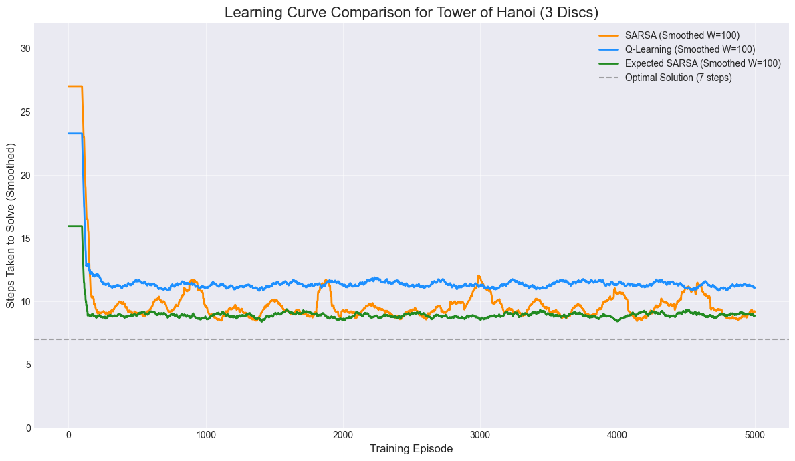
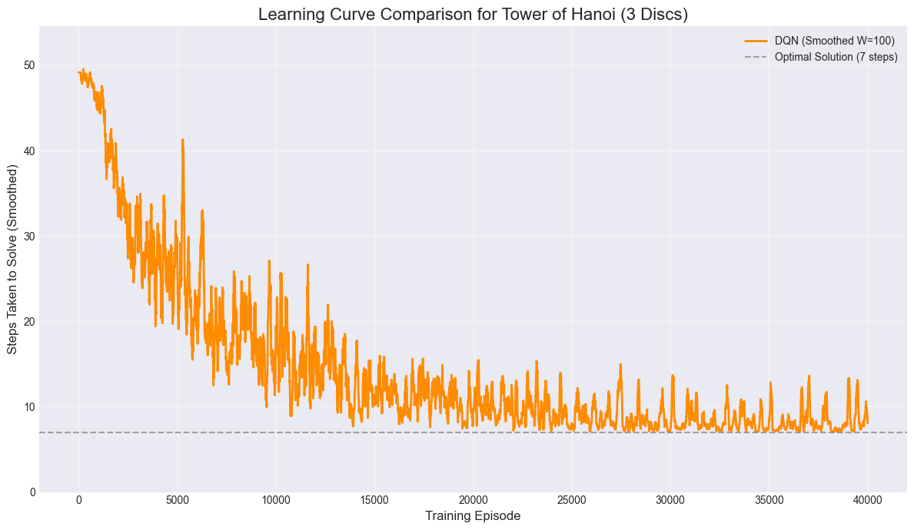

<center>
	
	<figcaption align="center">Animated solution of the 4 disc puzzle - Wikipedia</figcaption>
</center>

---

## Introduction

In this project, I explored the different foundation Reinforcement Learning (RL) algorithms - specifically Temporal Difference (TD) Q-table methods (SARSA, Q-Learning, Expected SARSA) and a Deep Q-Network (DQN) trained to solve the classic Tower of Hanoi puzzle. The objective is to compare their efficiency, convergence, and ability to find the optimal solution in this discrete action-space environment.

## Background

The Tower of Hanoi Problem was introduced during my first year computer science course (COMPSCI 1MA3) at McMaster University, Christopher Anand was my lecturer at that time. The problem was introduced to illustrate solving problems with recursion in Haskell.

## The Tower of Hanoi Problem

The Tower of Hanoi is a mathematical puzzle with a simple set of rules, making it an excellent testbed for RL.

**Problem Details**

- **Setup**: A set of $n$ disks of different sizes is stacked on one of three pegs (Source, Auxiliary, Destination) in increasing order of size (largest on the bottom).

- **Goal**: Move the entire stack to another peg, following these rules:

  - Only one disk can be moved at a time.
  - The top disk from any peg can be moved to any other peg.
  - A larger disk can never be placed on top of a smaller disk.

**The Deterministic Solution**

The problem has a well-known deterministic, optimal solution that requires $2^n - 1$ moves for $n$ disks. For example, a 3-disk problem requires $2^3 - 1 = 7$ moves. This optimal path provides a clear benchmark for our RL agents.

<center>
	
	<figcaption align="center">Optimal Solution of the 3 disc puzzle - GeeksforGeeks</figcaption>
</center>


Read more about The Tower of Hanoi Problem at [here](https://en.wikipedia.org/wiki/Tower_of_Hanoi) and [here](https://www.geeksforgeeks.org/dsa/c-program-for-tower-of-hanoi/).
You can also try the interactive puzzle [here](https://www.mathsisfun.com/games/towerofhanoi.html).

## Reinforcement Learning Overview

RL is a framework where an **agent** learns to make sequential decisions by interacting with an environment.

The Tower of Hanoi naturally fits this paradigm:
- **Agent**: The RL algorithm (e.g., Q-Learning).
- **Environment**: The state of the three pegs and the disks.
- **State**: The configuration of disks on the three pegs (e.g., a tuple representing the disk on top of each peg).
- **Action**: Moving the top disk from one peg to another valid peg (e.g., $Move(Peg_A \rightarrow Peg_C)$).
- Reward: A numerical value the agent receives after performing an action.
- **Episode**: A single run from the starting state until the goal state is reached (or a maximum number of steps is hit).
- **Q-Value ($Q(s, a)$)**: The expected future reward of taking action $a$ in state $s$. The agent's goal is to learn these values to choose the best action in every state.

**Bellman Equation for Action Value Function (Q-function)**
$$Q_{new}(s, a) \leftarrow Q(s, a) + \alpha [Reward + \gamma \max_{a'} Q(s', a') - Q(s, a)]$$

## The Environment

The environment is everything the learning agent interacts with. It is the simulation or real-world system that defines:

1. The possible **States** the agent can be in (what the agent observes).
2. The set of **Actions** the agent can take.
3. The **Dynamics (rules)** that govern how the environment transitions from one state to another when an action is taken.
4. The **Reward** or **Penalty** the agent receives for its actions.

The goal of the agent is to learn a **policy** or a strategy that maximizes the total cumulative reward received from this environment.

For this project a `TowerOfHanoiEnv` class is created which defined the formal environment for the agent to learn the optimal solution to the N-disk (default to 3), 3-peg Tower of Hanoi puzzle. 

The class defined:

**1. State Space (Observation)**
- Concept: The complete, unique configuration of all 3 discs across the 3 pegs.
- Implementation: The state is encoded as a fixed-length vector (9 elements, 3 pegs $ \times $ 3 slots). This state vector is padded with zeros for empty slots, ensuring the agent always observes a consistent, unambiguous representation of the board (e.g., (3, 2, 1, 0, 0, 0, 0, 0, 0)). Size: $3^3 = \mathbf{27}$ valid states.

**2. Action Space**
- Concept: The set of all possible moves between the pegs.
- Implementation: A set of 6 discrete actions (e.g. $ 0 \rightarrow 1 $, $ 1 \rightarrow 2 $, etc.) are mapped to the integer indices 0 through 5, which the agent chooses.

**3. Dynamics and Rewards**
- Dynamics: The environment enforces the puzzle's rule: no larger disk can be placed on a smaller disk (_is_valid_move).
- Reward Function (The Guide):
  - Goal State (+1): A large positive reward is given only when all discs are correctly stacked on the final peg (Peg 2).
  - Illegal Move (-1): A negative penalty is given for violating the rules, strongly discouraging invalid actions.
  - Legal Non-Goal Move (0): A neutral reward for standard moves, which implicitly forces the agent to seek the solution path that minimizes the number of steps to reach the +1 reward.

Termination: An episode ends either upon solving the puzzle or when the maximum step limit (default 50) is exceeded.

**4. Visualization**

The `TowerOfHanoiEnv` came with the render method that is a utility function for debugging and human interpretability of the agent's actions.

It will print out the puzzle state provided by the state tuple.

For example for the initial state:
$(3, 2, 1, 0, 0, 0, 0, 0, 0)$

To initiate the environment and fetch initial state:

```python
env = TowerOfHanoiEnv(n_discs=3)
state = env.reset()
env.render()
```

It will render as:
```python
  1    
  2
  3
__________________
  P1    P2    P3  
------------------
```


<details>
  <summary><u>Implementation of the Tower of Hanoi Environment in Python:</u></summary>

```python
import numpy as np

class TowerOfHanoiEnv:
    def __init__(self, n_discs=3, max_steps=50):
        self.n_discs = n_discs
        self.max_steps = max_steps
        self.actions = [(1,2),(1,3),(2,1),(2,3),(3,1),(3,2)] #action space
        self.reset()

    def reset(self):
        # Towers: top of stack on right
        self.towers = [list(range(self.n_discs, 0, -1)), [], []]
        self.steps = 0
        return self._get_state()

    def _get_state(self):
        # Flattened state (pad with 0s)
        state = []
        for peg in self.towers:
            s = peg + [0]*(self.n_discs - len(peg))
            state.extend(s)
        return np.array(state, dtype=int)

    def _is_valid_move(self, src, dest):
        # Check for illegal move
        if not self.towers[src]:
            return False
        if self.towers[dest] and self.towers[src][-1] > self.towers[dest][-1]:
            return False
        return True

    def step(self, action):
        """
        Action: integer 0-5 mapping to move (src, dest)
        Mapping: [(1->2),(1->3),(2->1),(2->3),(3->1),(3->2)]
        """
        src, dest = self.actions[action]
        src -= 1
        dest -= 1
        reward = 0
        done = False

        if self._is_valid_move(src, dest):
            self.towers[dest].append(self.towers[src].pop())
        else:
            reward = -1  # penalty for illegal move

        self.steps += 1

        if self.towers[2] == list(range(self.n_discs, 0, -1)):
            reward = 1  # solved
            done = True
        elif self.steps >= self.max_steps:
            done = True

        return self._get_state(), reward, done

    def render(self):
        # Render state to command line for human interpretability
        max_height = self.n_discs
        for level in range(max_height, 0, -1):
            row = []
            for peg in self.towers:
                if len(peg) >= level:
                    row.append(str(peg[level-1]).center(5))
                else:
                    row.append(" ".center(5))
            print(" ".join(row))
        print("__________________")
        print("  P1    P2    P3  ")
        print("-" * 18)
```
</details>

## Tabular Temporal Difference Learning

After defining the environment, the first RL approach involved using a **Q-Table** to store the $Q(s, a)$ value for every possible state-action pair. Since the 3-disk problem has a manageable number of states, this is feasible.

A **Q-Table** is essentially a **lookup table** used by a learning agent to help it make decisions in its environment.

- It is structured as a two-dimensional matrix:
  - Rows represent the possible States ($s$) the agent can be in.
  - Columns represent the possible Actions ($a$) the agent can take.

An example Q-Table:
<div align="center">

| states | action 1 | action 2 | action ... |
| ------ | -------- | -------- | ---------- |
| state 1 | -0.5    | 1.8      | ...        |
| state 2 | 0.0     | -2.7     | ...        |
| state 3 | 2.5     | -0.1      | ...        |
| ... | ...    | ...      | ...        |

</div>

Each cell in the table contains a Q-value ($Q(s, a)$), which is an **estimate of the expected future reward the agent will receive if it takes a specific action ($a$) while in a specific state ($s$)**, and then follows the optimal strategy thereafter.

For a 3 discs ($N$) and 3 pegs ($K$) setup, there are total of $N^K = 3^3 = 27$ possible states and $K \times (K - 1) = 3 \times (3 - 1) = 6$ distinct actions an agent can apply.

<div align="center">

| From Peg | To Peg | Actions |
| -------- | ------ | ------- |
| A | B | Move A $\rightarrow$ B |
| A | C | Move A $\rightarrow$ C |
| B | A | Move B $\rightarrow$ A |
| B | C | Move B $\rightarrow$ C |
| C | A | Move C $\rightarrow$ A |
| C | B | Move C $\rightarrow$ B |

</div>

Therefore the Q-Table for the Tower of Hanoi puzzle ($N=3$, $K=3$) is $ 27 \times 6 $.


### SARSA, Q-Learning, Expected SARSA

There are three common algorithms explored within the tabular temporal difference learning - SARSA, Q-Learning (a.k.a. SARSAMax) and Expected SARSA. They are known as the most common techniques used for model-free, off-policy and on-policy learning. They are all based on the concept of Temporal Difference (TD) learning, which involves updating an estimated Q-value based on a subsequent observed Q-value.

<details>
  <summary><u>Details about the algorithms:</u></summary>

**SARSA Update Rule**:
$$Q(s, a) \leftarrow Q(s, a) + \alpha \left[r + \gamma Q(s', a') - Q(s, a)\right]$$
Where $a'$ is the action selected by the current policy $\pi$ in state $s'$.

**Q-Learning (a.k.a. SARSAMax) Update Rule**:
$$Q(s, a) \leftarrow Q(s, a) + \alpha \left[r + \gamma \max_{a'} Q(s', a') - Q(s, a)\right]$$
Where $\max_{a'} Q(s', a')$ is the highest possible Q-value from the next state $s'$, irrespective of the action actually taken.

**Expected SARSA Update Rule**:
$$Q(s, a) \leftarrow Q(s, a) + \alpha \left[r + \gamma \sum_{a'} \pi(a'|s') Q(s', a') - Q(s, a)\right]$$
Where the sum calculates the weighted average of all possible next Q-values based on the current policy's probabilities ($\pi$).

Note:
- $\alpha$ - Learning Rate: extent to which the newly acquired information overrides the old information (the current Q-value).
- $\gamma$ - Discount Factor: determines the importance of future rewards vs. immediate rewards.

**Algorithm Comparison**
| Algorithm | Update Rule | Pros | Cons |
| --------- | ----------- | ---- | ---- |
| SARSA (On-Policy) | Uses Q(s′,a′) where a′ is the next action actually taken by the ϵ-greedy policy. | Guarantees convergence for ϵ-greedy policy, learns a safer policy. | Slower to converge to the optimal policy, as it explores inefficient moves. |
| Q-Learning (Off-Policy) | Uses Q(s′,a∗), where a∗ is the optimal action in the next state s′ (ignoring the exploration policy). | Learns the optimal policy Q∗. Often converges faster to optimality. | Learns an optimal policy outside the actual explored path; prone to high reward variance. |
| Expected SARSA (Off-Policy) | Uses the E[Q(s′,a′)] weighted by the probability of taking each action a′ in state s′. | Smoother learning than Q-Learning, better stability, learns the optimal policy. | Requires calculating the expected value (a sum over all next actions), computationally heavier. |

**On-Policy vs. Off-Policy**
- **On-policy** methods learn the value of the policy they are currently using to act.

- **Off-policy** methods use data generated by an exploratory policy to learn the value of a different, usually optimal and non-exploratory policy.

**ϵ-greedy policy**

The ϵ-greedy policy is a simple yet effective strategy used in Reinforcement Learning (RL) to manage the trade-off between exploration and exploitation. It dictates how an agent chooses its actions based on its current knowledge (Q-values).

- **Exploitation**: Choosing the action that has the highest estimated value (the best known action). This maximizes the immediate reward based on current knowledge.

- **Exploration**: Choosing a random action, which allows the agent to discover new states and potentially find actions that yield higher long-term rewards than those currently known.

</details>

### Results

For each algorithms, 5,000 episodes were simulated. i.e. the algorithm has done 5,000 iterations each either solved the puzzle within max 50 moves or terminated due to max moves reached. Each time agent made a move with ϵ = 10% (i.e. 10% chance to make a random move given the current state - 10% chance for exploration), the Q-table values is updated with the respective state-action Q-value.

Here is the learning curve comparison. i.e. the moving average of the total moves the agent taken from each episode.

<center>
	
</center>

This analysis compares the learning performance of SARSA, Q-Learning, and Expected SARSA on the 3-disc Tower of Hanoi puzzle (optimal solution: 7 steps). While curve smoothing and persistent $\epsilon$-greedy exploration prevent average steps from strictly reaching the optimum, all algorithms successfully executed the optimal 7-step solution during training.

**Comparative Performance Analysis**

Expected SARSA demonstrated the fastest and most robust convergence, achieving the earliest optimal solution at episode 31. Its also has the best stability resulted in the most consistent performance near the optimum.

Q-Learning showed surprisingly delayed initial performance. Despite its design to learn the optimal policy, it only achieved the optimal 7-step solution much later, at episode 606. Q-Learning consistently produced a higher average number of steps than the other two methods. This delayed convergence is attributed to the necessary testing and validation of its optimistic, off-policy updates by the behavior policy during early training.

SARSA performed very well, finding the optimal solution as early as episode 55. However the learning curve was not as stable as the other two methods.

<details>
  <summary><u>Implementation of the training process:</u></summary>

```python
import random
from TowerOfHanoiEnv import *

env = TowerOfHanoiEnv(n_discs=3)

# Hyperparameters
episodes = 5000
alpha = 0.1 # Learning Rate - extent to which the newly acquired information overrides the old information (the current Q-value).
gamma = 0.99 # Discount Factor - determines the importance of future rewards vs. immediate rewards.
epsilon = 0.2 # Epsilon Greedy (20% chance to explore new action)

algorithm_choice = 0
algorithm_choices = {0: 'sarsa', 1: 'q_learning', 2: 'expected_sarsa'} #q_learning a.k.a. sarsamax
current_algorithm = algorithm_choices[algorithm_choice]
print(f"{current_algorithm} RL algorithm is used.")

Q = {}
ep_steps = []

def select_action(state, Q, epsilon, action_space_size):
    """Epsilon-greedy action selection."""
    if state not in Q:
        # Add unseen state to Q-table
        Q[state] = [0.0] * action_space_size
        
    if random.random() < epsilon:
        # Explore: Choose a random action
        return random.randint(0, action_space_size - 1)
    else:
        # Exploit: Choose the best-known action
        return int(np.argmax(Q[state]))

for ep in range(episodes):
    print(f"Episode: {ep}\n")
    state = tuple(env.reset())
    done = False
    steps = 0

    action = select_action(state, Q, epsilon, len(env.actions))

    while not done:
        current_action = action
        
        next_state, reward, done = env.step(action)
        next_state = tuple(next_state)
        
        if next_state not in Q:
            Q[next_state] = [0]*len(env.actions)
        
        # td_target - Temporal Difference Target
        td_target = 0

        if done:
            td_target = reward
        else:
            greedy_action_idx = int(np.argmax(Q[next_state]))

            if current_algorithm == 'sarsa':
                action_for_next_step = select_action(next_state, Q, epsilon, len(env.actions))
                target_q_value = Q[next_state][action_for_next_step]
            elif current_algorithm == 'q_learning': #sarsamax
                # Greedy Policy - Use max (best) Q i.e. rewards from previous to select next action
                action_for_next_step = select_action(next_state, Q, epsilon, len(env.actions)) # Still need next step action for behavior (Off-Policy)
                target_q_value = max(Q[next_state])
            elif current_algorithm == 'expected_sarsa':
                # Expected SARSA: A' is the average value over the behavior policy
                action_for_next_step = select_action(next_state, Q, epsilon, len(env.actions)) # Still need next step action for behavior (Off-Policy)
                
                expected_q_value = 0
                prob_greedy = 1 - epsilon + (epsilon / len(env.actions))
                prob_non_greedy = epsilon / len(env.actions)

                for a_prime in range(len(env.actions)):
                    q_value = Q[next_state][a_prime]
                    if a_prime == greedy_action_idx:
                        expected_q_value += prob_greedy * q_value
                    else:
                        expected_q_value += prob_non_greedy * q_value
                target_q_value = expected_q_value

            # Calculate the target Q - only differences between the three methods
            td_target = reward + gamma * target_q_value
        # Update Q values
        old_q_value = Q[state][current_action]
        Q[state][current_action] = old_q_value + alpha * (td_target - old_q_value)
        
        state = next_state
        action = action_for_next_step 

        steps += 1
        env.render()
        print(f"Action: {env.actions[action]} Reward: {reward}\n")

    print(f"Episode {ep} Finished! Total steps: {steps}")
    ep_steps.append(steps)
```

</details>

<details>
  <summary><u>Final Q-Table from Expected SARSA:</u></summary>

| State |	(1, 2) | (1, 3) | (2, 1) | (2, 3) | (3, 1) | (3, 2) | best_move |
| ----- | ------ | ------ | ------ | ------ | ------ | ------ | --------- |
| (3, 2, 1, 0, 0, 0, 0, 0, 0) | 0.075281 | 0.187439 |	-0.971061 |	-0.971057 |	-0.971060 |	-0.971054 |	(1, 3) |
| (3, 2, 0, 1, 0, 0, 0, 0, 0) | -0.831940 | 0.013584 |	0.012789 |	0.187417 |	-0.815452 |	-0.792743 |	(2, 3) |
| (3, 0, 0, 1, 0, 0, 2, 0, 0) | -0.413558 | -0.577953 |	0.156089 |	-0.034169 |	-0.022135 |	-0.277103 |	(2, 1) |
| (3, 0, 0, 0, 0, 0, 2, 1, 0) | -0.030925 | -0.100004 |	-0.477923 |	-0.194165 |	0.016315 |	-0.030810 |	(3, 1) |
| (0, 0, 0, 3, 0, 0, 2, 1, 0) | -0.350220 | -0.191525 |	-0.020551 |	-0.351484 |	-0.022189 |	-0.020075 |	(3, 2) |
| (0, 0, 0, 3, 1, 0, 2, 0, 0) | -0.191602 | -0.190958 |	-0.018596 |	-0.017864 |	-0.015734 |	-0.419241 |	(3, 1) |
| (1, 0, 0, 3, 0, 0, 2, 0, 0) | -0.016545 | -0.015582 |	-0.415872 |	-0.276835 |	-0.276117 |	-0.016887 |	(1, 3) |
| (3, 1, 0, 0, 0, 0, 2, 0, 0) | -0.017275 | -0.035352 |	-0.415176 |	-0.392701 |	-0.373058 |	0.319704 |	(3, 2) |
| (3, 2, 0, 0, 0, 0, 1, 0, 0) | 0.320544 | -0.812580 |	-0.812584 |	-0.812577 |	0.028942 |	0.075287 |	(1, 2) |
| (3, 0, 0, 2, 0, 0, 1, 0, 0) | -0.679507 | -0.679509 |	0.187416 |	-0.679514 |	0.323786 |	0.449636 |	(3, 2) |
| (3, 1, 0, 2, 0, 0, 0, 0, 0) | 0.449593 | 0.265910 |	-0.646636 |	0.187752 |	-0.640434 |	-0.594036 |	(1, 2) |
| (3, 0, 0, 2, 1, 0, 0, 0, 0) | -0.550422 | 0.585302 |	0.323746 |	0.320510 |	-0.550457 |	-0.550443 |	(1, 3) |
| (0, 0, 0, 2, 1, 0, 3, 0, 0) | -0.414763 | -0.414754 |	0.718357 |	0.572364 |	0.449567 |	-0.414802 |	(2, 1) |
| (1, 0, 0, 2, 0, 0, 3, 0, 0) | 0.585214 | 0.572405 |	-0.281705 |	0.858238 |	-0.281718 |	-0.281688 |	(2, 3) |
| (0, 0, 0, 2, 0, 0, 3, 1, 0) | -0.430065 | -0.380925 |	0.156087 |	-0.397285 |	0.718319 |	0.461980 |	(3, 1) |
| (2, 0, 0, 0, 0, 0, 3, 1, 0) | -0.005120 | -0.363449 |	-0.247507 |	-0.395108 |	-0.002112 |	0.396416 |	(3, 2) |
| (2, 1, 0, 0, 0, 0, 3, 0, 0) | 0.087322 | -0.004142 |	-0.273496 |	-0.274181 |	-0.100000 |	-0.006605 |	(1, 2) |
| (2, 0, 0, 1, 0, 0, 3, 0, 0) | -0.271407 | 0.674633 |	-0.000287 |	0.034272 |	-0.310084 |	-0.191551 |	(1, 3) |
| (0, 0, 0, 1, 0, 0, 3, 2, 0) | -0.305323 | -0.256640 |	0.858193 |	0.717570 |	0.250321 |	-0.171201 |	(2, 1) |
| (1, 0, 0, 0, 0, 0, 3, 2, 0) | 0.714351 | 1.000000 |	-0.141805 |	-0.141801 |	-0.141809 |	0.718287 |	(1, 3) |
| (0, 0, 0, 0, 0, 0, 3, 2, 1) | 0.000000 | 0.000000 |	0.000000 |	0.000000 |	0.000000 |	0.000000 |	(1, 2) |
| (1, 0, 0, 3, 2, 0, 0, 0, 0) | -0.015486 | -0.016414 |	-0.191504 |	-0.017834 |	-0.349199 |	-0.194357 |	(1, 2) |
| (0, 0, 0, 3, 2, 1, 0, 0, 0) | -0.272894 | -0.191525 |	-0.013734 |	-0.011694 |	-0.101263 |	-0.193889 |	(2, 3) |
| (0, 0, 0, 3, 2, 0, 1, 0, 0) | -0.274153 | -0.192381 |	-0.017178 |	-0.100960 |	-0.015711 |	-0.015948 |	(3, 1) |
| (2, 0, 0, 3, 0, 0, 1, 0, 0) | -0.012178 | -0.273505 |	-0.274876 |	-0.192734 |	-0.010320 |	-0.012382 |	(3, 1) |
| (2, 1, 0, 3, 0, 0, 0, 0, 0) | -0.011507 | -0.012488 |	-0.190346 |	-0.009123 |	-0.192174 |	-0.192999 |	(2, 3) |
| (2, 0, 0, 3, 1, 0, 0, 0, 0) | -0.190330 | -0.014598 |	-0.014421 |	-0.013246 |	-0.192705 |	-0.351353 |	(2, 3) |

</details>


<details>
  <summary><u>Solution found by Expected SARSA:</u></summary>

```
step 0:

  1              
  2              
  3              
__________________
  P1    P2    P3  
------------------

step 1: 1->3
                 
  2              
  3           1  
__________________
  P1    P2    P3  
------------------

step 2: 1->2
                 
                 
  3     2     1  
__________________
  P1    P2    P3  
------------------

step 3: 3->2
                 
        1        
  3     2        
__________________
  P1    P2    P3  
------------------

step 4: 1->3
                 
        1        
        2     3  
__________________
  P1    P2    P3  
------------------

step 5: 2->1
                 
                 
  1     2     3  
__________________
  P1    P2    P3  
------------------

step 6: 2->3
                 
              2  
  1           3  
__________________
  P1    P2    P3  
------------------

step 7: 1->3
              1  
              2  
              3  
__________________
  P1    P2    P3  
------------------
```

</details>


<details>
  <summary><u>To reuse a trained agent:</u></summary>

```python
done = False
step = 0

# Setup environment
env = TowerOfHanoiEnv(n_discs=3)
state = tuple(env.reset()) #initial state
print(f"step {step}:\n")
env.render()

while not done:
    action = Q[state].index(max(Q[state])) # Choose best action given by Q-Table
    step += 1
    print(f"\nstep {step}: {env.actions[action][0]}->{env.actions[action][1]}")
    next_state, reward, done = env.step(action)
    state = tuple(next_state)
    env.render()
```

</details>

## Deep Q-Network (DQN)

Tabular Temporal Difference Learning is perfect for problems with small action-state space, otherwise for a larger complex problems where the action-state space becomes too vast to fit in a table. For example a 6 discs 3 pegs puzzle quickly grow into $6^3 = 216 rows$ and there are totalling  $216 \times 6 = 1,296$ Q-values in the tables to be update, that leads to much more episodes for a stable convergence towards the final state. This is where Deep Q-Network (DQN) shines.

Instead of a Q-Table, a Neural Network (NN) is used as a function approximator to estimate the $Q(s,a)$ values.

Note, a well designed Neural Network may able to *generalize* without seeing all possible states where an agent trained with the incomplete Q-Table (not all possible states were seen given a finite time) is almost guaranteed not successful, as it only follows the trained Q-value from the Q-Table strictly to action.

### QNetwork

The Q-Network serves as the function approximator in the Deep Q-Network (DQN) agent, estimating the expected long-term return, or Q-Value, for taking a specific action in a given state, $Q(s, a)$.

**Network Structure**

The network is structured as a standard Fully-Connected (Feedforward) Neural Network (Multilayer Perceptron):

- **Input Layer**: Accepts the current state $s$ as input. For the 3-disc Tower of Hanoi, this is a flattened vector of length $N \times 3$ (i.e., $3 \times 3 = 9$) that numerically represents the disc configuration across the three pegs.

- **Hidden Layers**: The core of the network features two hidden layers, each consisting of 64 nodes. The Rectified Linear Unit ($\text{ReLU}$) activation function is applied after each hidden layer to introduce the necessary non-linearity, enabling the network to learn complex relationships within the state space.

- **Output Layer**: Produces a vector of Q-values, where the dimension equals the size of the action space (6 possible moves). Each output node represents the estimated value for one specific action.

**Q-Learning Mechanism**

The network's primary function is to replace the traditional Q-Table. In essence, the vast array of state-action values is now implicitly encoded within the weights and biases of the network. Through iterative training based on rewards and penalties received, the Q-Network learns to approximate the optimal Q-Value for every state-action pair.

The learning process stays rooted in the principles of Q-Learning by leveraging the Bellman Optimality Equation. This equation provides a major efficiency improvement by not only learning from the immediate reward but also by bootstrapping the future expected return. The key concept is the calculation of the Target Q-Value, which is used to update the current Q-estimate. It is derived by "looking ahead" to the maximum possible discounted value from the next state ($s'$), thus giving the agent a stronger and more efficient sense of the long-term value associated with each action taken.

### Bellman Optimality Equation

DQN is a value-based method that is trained to satisfy the Bellman Optimality Equation. The loss function for DQN is based on minimizing the difference between the current Q-estimate and the Bellman target:

$$\text{Loss} = \left[ (\text{Current Q-value}) - (\text{Target Q-value}) \right]^2$$

Where the Target Q-value is calculated as:

$$\text{Target} = R + \gamma \cdot \max_{a'} Q_{\text{target}}(s', a')$$

The network must output Q-values so that:
- The Current Estimate (The left side of the equation) can be read directly from the network's output for the specific action $a$ that was taken.
- The Target Estimate (The right side of the equation) can be calculated using the $\max$ function over the Q-values predicted for the next state, $s'$, which requires the network to output the value for all possible next actions $a'$.

In short, the DQN is a value estimator because the math behind Q-Learning fundamentally requires it to estimate the future cumulative reward (the Q-value) in order to define a training target and guide action selection.

One drawback (also strength) is that now it may take lot more episodes to train the NN (many more parameters to update - converges). So we may not know how many episodes is enough for the NN to converge or giving it too many episodes to run when it converges.

Solution is simple:
- If realized not enough episodes then just add more
- If agent's performance does not signifcantly improved after a while then stop (i.e. Early Stopping)

### Dynamic ϵ

Unlike the tabular Q-learning methods, where the exploration rate $\epsilon$ was held constant, in this Deep Q-Network (DQN) implementation, $\epsilon$ undergoes a decaying process (annealing). This strategy is used to balance the exploration-exploitation trade-off: starting with a high $\epsilon$ encourages maximum exploration early in training to discover the environment's rewards, while gradually reducing $\epsilon$ forces the agent to rely more on its learned Q-values (exploitation) later on.

Crucially, as training nears its end, $\epsilon$ must approach its minimum (e.g., $0.001$ or $0.0$) to solidify the knowledge. This extended exploitation phase is essential for bootstrapping the maximum rewards back through the entire optimal sequence of states. If $\epsilon$ is still high when training stops and the "best agent" is saved, the saved Q-values are unreliable: the optimal solution may have been found by a random exploration step, and the surrounding Q-values haven't converged.

Consequently, when this model is used for inference with a purely greedy policy ($\mathbf{\epsilon = 0.0}$), the agent is forced to choose the mathematically highest, but often suboptimal, Q-value at a critical junction, causing it to deviate from the optimal path and potentially lead to a long cycle or max-step failure. For deterministic systems like the Tower of Hanoi, a fully decayed $\epsilon$ is vital to ensure the final action choice is robustly greedy and optimal. In contrast, dynamic or stochastic systems sometimes benefit from a small, non-zero $\epsilon$ even during deployment to maintain flexibility and avoid getting stuck.

### Training

**Experience Generation and Exploration**

At the start of each episode, the agent begins by interacting with the environment, generating experiences. The action selection follows an $\epsilon$-greedy policy. The agent's $\epsilon$ starts high (**EPS_START** = 1.0) to encourage maximum exploration, allowing it to randomly discover the path to the solution. As training progresses, $\epsilon$ decays per episode at a rate of **EPS_DECAY** ($0.9998$) until it reaches a minimum (**EPS_END** = $0.001$), shifting the policy toward **exploitation** of the learned Q-values. The resulting state-action-reward-next state tuples are stored in a **Replay Buffer**, which has a capacity of **BUFFER_SIZE** ($100,000$). This large memory is crucial for breaking the correlation between sequential steps and providing a diverse data set for stable training.


**Learning and Value Estimation**

The agent is designed to learn every **UPDATE_EVERY** steps (4 steps). When learning is triggered, a random batch of past experiences, defined by **BATCH_SIZE** (64), is uniformly sampled from the Replay Buffer. This experience is used to perform the Q-value update via the Bellman equation. The core innovation of DQN is the use of two distinct networks: the Local Q-Network (`qnetwork_local`), which is actively being trained, and the Target Q-Network (`qnetwork_target`). The Target Network is used to calculate the stable Target Q-value ($Q_{\text{target}}$) to prevent the system from chasing a moving target during updates.

The Target Q-value is calculated using the **GAMMA_DQN** (Discount Factor) of $0.99$. This high value signifies that the agent is highly far-sighted, placing significant importance on future rewards (like the ultimate goal of solving the puzzle) over immediate rewards. The difference between the Expected Q-value (from the local network) and the Target Q-value forms the basis of the Mean Squared Error (MSE) loss. This loss is then minimized using the Adam optimizer with a LR (**Learning Rate**) of $2 \times 10^{-4}$ to update the weights of the Local Q-Network.

**Stabilization and Convergence**

To further stabilize the learning process, the Target Network is synchronized with the Local Network every **TARGET_UPDATE_FREQ** steps (50 steps). This delayed synchronization ensures that the target values remain consistent for a sufficient period, allowing the Local Network to converge effectively. A critical aspect of the training for a deterministic, minimal-step problem like Tower of Hanoi is ensuring that the $\epsilon$ decay fully completes. As established, if training halts while $\epsilon$ is still high, the saved "best agent" may not have robustly encoded the optimal path as the greedy action in every state, leading to suboptimal performance or failure during pure greedy inference.


### Result

<center>
	
</center>

As expected under the listed conditions, the DQN takes much longer to train to produce the optimal solution reliably. The model first reached the optimal 7-steps solution at episode 1504, however the $\epsilon$ at that point is still high (~0.80) hence the agent is still in the exploration stage and it was by random chance that it stubble upon the optimal solution.

As training goes, $\epsilon$ decaying slowly to the minimum 0.001 (i.e. the final trained agent would still have 0.1% chance of picking a random action). Ideally this should be set to 0.0 as mentioned above. The average step per episode also steadily converages to the optimal 7-step as training goes - as seen from the learning curve.

The final DQN agent can reliably solve the 3 discs 3 pegs puzzle in 7 steps, however it won't be able to solve the puzzle in any other configuration. i.e. transfer learning is more difficult for a setup like this. The agent can't *generalized* to a bigger puzzle, as the neural network is a fixed sized input and output.

To scale up for a larger puzzle the DQN will also needed to be more sophasticated. e.g. a 9 discs 3 pegs puzzle will have an optimal $ 2^9 - 1 = 511$ moves and $3^9 = 19,683$ possible states. Need a much bigger network.

<details>
  <summary><u>DQN Implementation:</u></summary>

```python
import numpy as np
import random
from collections import deque, namedtuple

from TowerOfHanoiEnv import *

import torch
import torch.nn as nn
import torch.optim as optim
import torch.nn.functional as F

class QNetwork(nn.Module):
    def __init__(self, state_size, action_size, seed):
        """Initializes parameters and builds model.
        
        Args:
            state_size (int): Dimension of each state (e.g., 9 for 3 discs).
            action_size (int): Dimension of action space (6 possible moves).
            seed (int): Random seed for reproducibility.
        """
        super(QNetwork, self).__init__()
        # Set a seed for reproducibility
        self.seed = torch.manual_seed(seed)
        
        # Simple feedforward network
        self.fc1 = nn.Linear(state_size, 256)
        self.fc2 = nn.Linear(256, 256)
        self.fc3 = nn.Linear(256, 128)
        self.fc4 = nn.Linear(128, action_size)

    def forward(self, state):
        """Maps state input to action Q-values."""
        x = F.relu(self.fc1(state))
        x = F.relu(self.fc2(x))
        x = F.relu(self.fc3(x))
        return self.fc4(x)        

# Hyperparameters for the Agent
BUFFER_SIZE = int(1e5)  # Replay buffer size
BATCH_SIZE = 64         # Minibatch size for sampling
GAMMA_DQN = 0.99        # Discount factor
LR = 2e-4               # Learning rate of the optimizer
UPDATE_EVERY = 4        # How often to update the network (step count)
TARGET_UPDATE_FREQ = 50 # How often to update the target network (step count)

# Define the device for PyTorch operations
device = torch.device("cuda:0" if torch.cuda.is_available() else "cpu")

# Replay Buffer named tuple
Experience = namedtuple('Experience', field_names=['state', 'action', 'reward', 'next_state', 'done'])

class ReplayBuffer:
    """Fixed-size buffer to store experience tuples."""
    def __init__(self, buffer_size, batch_size, seed):
        self.memory = deque(maxlen=buffer_size)  
        self.batch_size = batch_size
        self.seed = random.seed(seed)
    
    def add(self, state, action, reward, next_state, done):
        """Add a new experience to memory."""
        e = Experience(state, action, reward, next_state, done)
        self.memory.append(e)
    
    def sample(self):
        """Randomly sample a batch of experiences from memory."""
        experiences = random.sample(self.memory, k=self.batch_size)

        # Convert experiences to Tensors
        states = torch.from_numpy(np.vstack([e.state for e in experiences if e is not None])).float().to(device)
        actions = torch.from_numpy(np.vstack([e.action for e in experiences if e is not None])).long().to(device)
        rewards = torch.from_numpy(np.vstack([e.reward for e in experiences if e is not None])).float().to(device)
        next_states = torch.from_numpy(np.vstack([e.next_state for e in experiences if e is not None])).float().to(device)
        dones = torch.from_numpy(np.vstack([e.done for e in experiences if e is not None]).astype(np.uint8)).float().to(device)
  
        return (states, actions, rewards, next_states, dones)

    def __len__(self):
        """Return the current size of internal memory."""
        return len(self.memory)

class DQNAgent:
    """Interacts with and learns from the environment."""
    def __init__(self, state_size, action_size, seed):
        self.state_size = state_size
        self.action_size = action_size
        self.seed = random.seed(seed)

        # Q-Network (Local and Target)
        self.qnetwork_local = QNetwork(state_size, action_size, seed).to(device)
        self.qnetwork_target = QNetwork(state_size, action_size, seed).to(device)
        self.optimizer = optim.Adam(self.qnetwork_local.parameters(), lr=LR)

        # Replay memory
        self.memory = ReplayBuffer(BUFFER_SIZE, BATCH_SIZE, seed)
        # Initialize time step for learning updates
        self.t_step = 0
    
    def step(self, state, action, reward, next_state, done):
        # Save experience in replay memory
        self.memory.add(state, action, reward, next_state, done)
        
        # Learn every UPDATE_EVERY time steps.
        self.t_step = (self.t_step + 1) % UPDATE_EVERY
        if self.t_step == 0:
            # If enough samples are available in memory, get a random subset and learn
            if len(self.memory) > BATCH_SIZE:
                experiences = self.memory.sample()
                self.learn(experiences, GAMMA_DQN)

        # Update target network every TARGET_UPDATE_FREQ steps
        if self.t_step % TARGET_UPDATE_FREQ == 0:
            self.update_target_network()

    def act(self, state, epsilon, inference=False):
        """Returns actions for given state as per current policy (epsilon-greedy)."""
        # Convert state from numpy array to PyTorch tensor
        state = torch.from_numpy(state).float().unsqueeze(0).to(device)
        
        # Get Q-values from local network
        self.qnetwork_local.eval() # Set network to evaluation mode (no gradient tracking)
        with torch.no_grad():
            # Note: Using torch.no_grad() is crucial during action selection to prevent training.
            action_values = self.qnetwork_local(state)

        if not inference:
            self.qnetwork_local.train() # Set network back to training mode

        # Epsilon-greedy action selection
        if random.random() > epsilon:
            return np.argmax(action_values.cpu().data.numpy()) # Best action
        else:
            return random.choice(np.arange(self.action_size)) # Random action
    
    def learn(self, experiences, gamma):
        """Update value parameters using given batch of experience tuples."""
        states, actions, rewards, next_states, dones = experiences

        # Get max predicted Q values (for next states) from target model
        # The Q-Learning update rule uses the max Q value for the next state
        Q_targets_next = self.qnetwork_target(next_states).detach().max(1)[0].unsqueeze(1)
        
        # Compute Q targets for current states: Q_target = R + gamma * max_a(Q_target(s', a))
        Q_targets = rewards + (gamma * Q_targets_next * (1 - dones))

        # Get expected Q values from local model: Q_expected = Q_local(s, a)
        # Gather the Q-value for the action that was actually taken
        Q_expected = self.qnetwork_local(states).gather(1, actions)

        # Compute loss (Mean Squared Error)
        loss = F.mse_loss(Q_expected, Q_targets)
        
        # Minimize the loss
        self.optimizer.zero_grad()
        loss.backward()
        self.optimizer.step()

    def update_target_network(self):
        """Soft update model parameters: $\\theta_{\\text{target}} = \\tau*\\theta_{\\text{local}} + (1 - \\tau)*\\theta_{\\text{target}}$"""
        # A full copy is often used in basic DQN, meaning $\\tau=1$.
        # This is a full copy update.
        for target_param, local_param in zip(self.qnetwork_target.parameters(), self.qnetwork_local.parameters()):
            target_param.data.copy_(local_param.data)

    def save_agent(self, path):
        torch.save(self.qnetwork_local.state_dict(), path)
    
    def load_agent(self, path):
        self.qnetwork_local.load_state_dict(torch.load(path))
        self.qnetwork_target.load_state_dict(torch.load(path))

# --- DQN Specific Hyperparameters ---
EPISODES_DQN = 40000 
EPS_START = 1.0       # Starting value of epsilon
EPS_END = 0.001       # Minimum value of epsilon
EPS_DECAY = 0.9998    # Decay rate for epsilon - lower epsilon after each episode (i.e. less likely to choose random actions later in the training)
SEED = 0
best_agent_path = "TowerHanoi_DQN.pth"

# --- Environment Setup (Using the existing TowerOfHanoiEnv) ---
env = TowerOfHanoiEnv(n_discs=3, max_steps=50)
state_size = env.n_discs * 3 # 3 pegs * n_discs (for padding)
action_size = len(env.actions)

# --- Initialize the DQNAgent ---
agent = DQNAgent(state_size=state_size, action_size=action_size, seed=SEED)

# --- DQN Training Loop ---
eps = EPS_START             # Initialize epsilon
ep_steps_DQN = []
solved_in_episodes = None
min_steps = 2**env.n_discs - 1 # Optimal moves for N discs

print(f"--- Starting DQN Training for {env.n_discs} Discs ---")

for ep in range(EPISODES_DQN):
    state = env.reset() # State is a numpy array
    done = False
    steps = 0
    
    while not done:
        # Agent selects an action using epsilon-greedy policy
        action = agent.act(state, eps)
        
        # Environment takes a step
        next_state, reward, done = env.step(action)
        
        # Agent stores experience and learns
        # Note: We pass the action index (int) and the reward/done must be float/int
        agent.step(state, action, reward, next_state, done)
        
        state = next_state
        steps += 1
        
        # Print rendering for every 100 episodes
        if ep % 1000 == 0:
             env.render()
             print(f"Action: {env.actions[action]} Reward: {reward}")

    eps = max(EPS_END, eps * EPS_DECAY)
    
    ep_steps_DQN.append(steps)
    
    # Check for successful completion
    if env.towers[2] == list(range(env.n_discs, 0, -1)):
        status = "**SOLVED!**"

        # Cheating:
        if steps == min_steps and solved_in_episodes is None:
            # if reached optimal solution (mininum steps)
            # However this doesn't mean anything when epsilon is still high (i.e. best step is still by random chance)
            solved_in_episodes = ep
    else:
        status = "Max steps reached"
        
    if ep % 100 == 0 or steps == min_steps:
        print(f"\nEpisode {ep}/{EPISODES_DQN} | Steps: {steps} | Status: {status} | Epsilon: {eps:.4f} | Avg Steps (last 100 episodes): {np.mean(ep_steps_DQN[-100:]):.1f}")
        
    if solved_in_episodes is not None and eps <= EPS_END: # <-- Only stop if epsilon has reached its minimum
        print("Stop early since epsilon has decayed and no significant improvement found.")
        break

# Save final agent**
agent.save_agent(best_agent_path)
print(f"\nFinal Agent Saved!")

print("\n--- DQN Training Finished ---")
if solved_in_episodes is not None:
    print(f"Optimal (?) solution found at episode: {solved_in_episodes} with {ep_steps_DQN[solved_in_episodes]} steps.")
print(f"Final average steps (last 100 episodes): {np.mean(ep_steps_DQN[-100:]):.1f}")
```

</details>

<details>
  <summary><u>To reuse trained DQN:</u></summary>

```python
done = False
step = 0

# Setup environment
env = TowerOfHanoiEnv(n_discs=3)
state = env.reset()
print(f"step {step}:\n")
env.render()

best_agent = DQNAgent(state_size=state_size, action_size=action_size, seed=0) # Seed won't be needed if epsilon is decay to 0.0
best_agent.load_agent(best_agent_path)

while not done:
    action = agent.act(state, 0.001, inference=True) # Turn on inference and set epsilon to the final epsilon value
    step += 1
    next_state, reward, done = env.step(action)
    print(f"\nstep {step}: {env.actions[action]} Reward: {reward}")
    state = next_state
    env.render()
print(f"Total steps: {step}")
```

</details>

## What I've learned

In this project I explored the different common Reinforcement Learning and reinforced (pun intended) my understanding in the key concept such as Temporal Differences, SARSA, Q-Learning, Expected SARSA, Q-Table, Deep Q-Network, Bellman Equations, ϵ-greedy, reward mechanism.

While experimenting a well designed reward system is vital to a successful Reinforcement Learning process. Although given the limited time I gave myself for this project, there are more to be explored such as see if I can train the DQN with 5,000 episodes of less by changing the reward mechanism (e.g. penality on redundant steps, small reward for each progressive move). The current training process is significantly longer and very slow to converge.

The Tower of Hanoi puzzle can be solved with [recursive programming](https://en.wikipedia.org/wiki/Tower_of_Hanoi#Recursive_solution).

<details>
  <summary><u>Recursive Implementation:</u></summary>

```python
def hanoi_solver(n, src, dest, aux, moves_list):
    """
    Finds the optimal sequence of moves to solve the Tower of Hanoi puzzle.

    Args:
        n (int): The number of discs to move.
        src (int): The source peg (1, 2, or 3).
        dest (int): The destination peg (1, 2, or 3).
        aux (int): The auxiliary (temporary) peg (1, 2, or 3).
        moves_list (list): A list to append the required moves (src, dest) to.
    """
    if n == 1:
        # Base case: Move the single disc from source to destination
        moves_list.append((src, dest))
        return

    # 1. Move n-1 discs from source to auxiliary peg
    hanoi_solver(n - 1, src, aux, dest, moves_list)
    # 2. Move the largest disc (n) from source to destination peg
    moves_list.append((src, dest))
    # 3. Move n-1 discs from auxiliary to destination peg
    hanoi_solver(n - 1, aux, dest, src, moves_list)

def solve_hanoi_with_env(env):
    """
    Uses the recursive solver to get the optimal moves and applies them 
    to the provided TowerOfHanoiEnv instance.

    Args:
        env (TowerOfHanoiEnv): The environment instance (must be reset).
    
    Returns:
        list: The sequence of moves (tuples) found by the solver.
    """
    n_discs = env.n_discs
    
    # Pegs are 1, 2, 3 (consistent with environment's action definition)
    src_peg = 1
    dest_peg = 3
    aux_peg = 2
    
    optimal_moves = []
    
    # Generate the optimal sequence of moves
    hanoi_solver(n_discs, src_peg, dest_peg, aux_peg, optimal_moves)
    
    print(f"Optimal Moves Generated: {len(optimal_moves)} (2^{n_discs} - 1)")
       
    # Convert (src, dest) tuple to the environment's action index (0-5)
    action_map = {move: i for i, move in enumerate(env.actions)}
    
    print("\nStarting Board State:")
    env.render()
    
    for move in optimal_moves:
        # Get the action index for the move
        action_index = action_map[move]
        
        # Take a step in the environment
        _, _, done = env.step(action_index)
        
        # Render the board
        env.render()
        
        if done:
            break
            
    print("\n--- Solving Complete ---")
    print(f"Final Steps: {env.steps}")
    print(f"Solved: {env.towers[2] == list(range(n_discs, 0, -1))}")
    env.render()
    
    return optimal_moves

# %%
env_3discs = TowerOfHanoiEnv(n_discs=3, max_steps=800)
solve_hanoi_with_env(env_3discs)
```

</details>

## References

- [Tower of Hanoi Wikipedia](https://en.wikipedia.org/wiki/Tower_of_Hanoi)

- [Reinforcement Learning](https://en.wikipedia.org/wiki/Reinforcement_learning)

- [Temporal Difference](https://en.wikipedia.org/wiki/Temporal_difference_learning)

- [SARSA](https://en.wikipedia.org/wiki/State-action-reward-state-action)

- [Q-Learning](https://en.wikipedia.org/wiki/Q-learning)

- [Bellman Equation](https://en.wikipedia.org/wiki/Bellman_equation)

- [DQN - PyTorch](https://docs.pytorch.org/tutorials/intermediate/reinforcement_q_learning.html)

- [Policy gradient](https://en.wikipedia.org/wiki/Policy_gradient_method)

- [Multi-agent RL](https://en.wikipedia.org/wiki/Multi-agent_reinforcement_learning)


