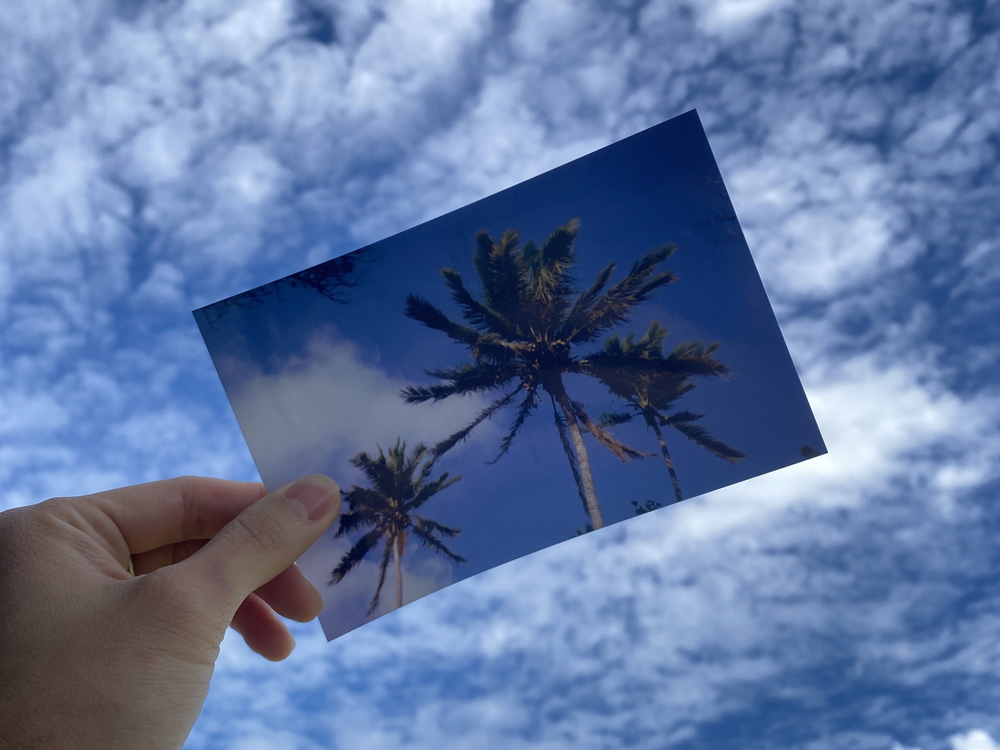

<center>
	
	<figcaption align="center">Photo of a Photo © Steven Lio</figcaption>
</center>

---

<style>
* {
  box-sizing: border-box;
}
.column {
  float: left;
  width: 30%;
  padding: 0px;
}
.row::after {
  content: "";
  clear: both;
  display: table;
}
img {
  display: block;
  margin-left: auto;
  margin-right: auto;
}
</style>

## Introduction

The goal of this project was to develope a classification machine learning model as a proof-of-concept capable of reliably detecting wheather an image is an original photograph or a scanned reproduction of another picture for *Trusting Pixel Inc.* (Vancouver, Canada).
This project served as my Capstone project during my Master of Data Science program at the University of British Columbia where I collaborated with three other students.

*<b>Disclaimer:</b> Due to NDA, I am not able to disclose details of the model but I will document the process of discovery and challenges we faced during the project.*

## Background

Image authenticity recognition is crucial for upholding trust and credibility in digital content, preventing misinformation, and protecting intellectual property. 
Advancements in deep learning models like DALL-E which is capable of generating realistic images which prompt more reseaches focus into image authenitication. 
But I believe most of these researches maybe hidden from the public because revealing the principle behind any security system will immediately compromise its effectiveness. 

For most people, likely the "photo of a photo" problem isn't significant. However, for companies in the fashion and entertainment industries, they rely heavily on reviewing 
unaltered professional headshots or body shots of the models, actors, and actresses they are considering for hire.

This project piqued my interest because I have been experimenting with different computer vision techniques even before getting my master's degree and have always wanted to gain more experiences in developing Neural Networks.

## Data Preprocessing

*Trusting Pixel Inc.* provided the project with a collection of geninue digital images as well as their recaptured version on the printed photo.
The first challenge we faced was the lack of linkage between the geninue images and their recaptured counterparts. This is important for developing a model that extract clues and evidence unique to recaptured images of photos and not
memorizing the subjects in the training images.

I developed a process in Python for automatically pairing the geninue image with its recaptured counterpart and return the pair in the same orientation.

In order to find the similar pair of images, I've first calculated a similarity score (0 to 1) between the image and all the other images in the set. Then the image in the set with the highest score
will get paired up. Then repeat until all images has found at least a pair. I've calculated a similarity score for each possible pair of images using the SIFT<sup>[1](https://en.wikipedia.org/wiki/Scale-invariant_feature_transform)</sup> algorithm.

It worked amazingly well even when I am trying to pair a geninue images with a picture of its printed photo.

<details>
  <summary><u>Click here to see a implementation of SIFT Similarity calculation in Python:</u></summary>

```python
import cv2
import matplotlib.pyplot as plt

def sift_similarity(img1, img2):
    """
    Calculate similarity scores based on SIFT descriptors
    
    Args:
        img1 (numpy.ndarray): Input image 1
        img2 (numpy.ndarray): Input image 2
    
    Returns:
        float: similarity scores between image 1 and image 2
    """
    sift = cv2.SIFT_create()
    kp_1, desc_1 = sift.detectAndCompute(img1, None)
    kp_2, desc_2 = sift.detectAndCompute(img2, None)

    index_params = dict(algorithm=0, trees=5)
    search_params = dict()
    flann = cv2.FlannBasedMatcher(index_params, search_params)
    matches = flann.knnMatch(desc_1, desc_2, k=2)

    good_points = []
    ratio = 0.6
    for m, n in matches:
        if m.distance < ratio*n.distance:
            good_points.append(m)

    #calculate similarity score:
    number_keypoints = 0
    if len(kp_1) <= len(kp_2):
        number_keypoints = len(kp_1)
    else:
        number_keypoints = len(kp_2)

    try:
        match_rate = len(good_points) / number_keypoints
    except:
        match_rate = 0
    return match_rate
	
# Test on images
img1 = cv2.imread("img1.jpeg")
img2 = cv2.imread("img2.jpeg")
img3 = cv2.imread("img3.jpeg")

# Display images
fig, axes = plt.subplots(1, 3, figsize=(15,5))
axes[0].imshow(cv2.cvtColor(img1, cv2.COLOR_BGR2RGB))
axes[0].set_title('Image 1')
axes[0].axis('off')
axes[1].imshow(cv2.cvtColor(img2, cv2.COLOR_BGR2RGB))
axes[1].set_title('Image 2')
axes[1].axis('off')
axes[2].imshow(cv2.cvtColor(img3, cv2.COLOR_BGR2RGB))
axes[2].set_title('Image 3')
axes[2].axis('off')

plt.tight_layout()
plt.show()

# Print scores to console
print("SIFT Similarity between 'Image 1' and 'Image 1' is {0:.2f}.".format(sift_similarity(img1, img1)))
print("SIFT Similarity between 'Image 1' and 'Image 2' is {0:.2f}.".format(sift_similarity(img1, img2)))
print("SIFT Similarity between 'Image 2' and 'Image 3' is {0:.2f}.".format(sift_similarity(img2, img3)))
```
</details>

<div class="row">
  <div class="column">
    <figcaption align="center">Image 1</figcaption>
	
  </div>
  <div class="column">
  	<figcaption align="center">Image 2</figcaption>
	
  </div>
    <div class="column">
  	<figcaption align="center">Image 3</figcaption>
	
  </div>
</div>

The output from the Python script:

```text
SIFT Similarity between 'Image 1' and 'Image 1' is 1.00.
SIFT Similarity between 'Image 1' and 'Image 2' is 0.67.
SIFT Similarity between 'Image 2' and 'Image 3' is 0.26.
```

After having pairing the images, they were moved to a new folder and renamed to keep track of their pairing, making them ready for the next step.

## Modeling

Although Convolution Neural Networks (CNNs) are popular for solving computer vision tasks with images data, it wasn't entirely feasible at the time due to our small dataset
and limited computing power, making training a large Neural Network unrealistic.

That led us to using traditional classification models. However, these models require a feature matrix as input, and feeding the full-sized images would result in an enormous matrix.
After analyzing the geninue images and their recaptured counterparts, we noticed that recaptured images exhibit distinct characteristics. Resizing the images for modeling would have caused us 
to lose these critical details, which is also why we didn't start with CNNs. The unique features of recaptured images arise from the printing process, where some original image details are lost 
and new features, like the texture of the print, are added.

Therefore, we began research image processing techniques to extract these features precisely. We compared the resulting feature value distributions produced by each techniques and to decide the 
techniques to apply and which features to create.

We trained multiple clasifical models with the feature matrix, performing hyperparameter tuning and evaluatng the goodness of the fit to arrive at the final model
that best distinguished between geninue image vs. recaptured images for the images we had.

Although we attempted to use CNNs, the results were not significantly better in classifying the testing images. However this does not rule out the possibility that CNNs could eventually prove to be 
the best overall approach.

## Caveats

The project aims to showcase the potential of using the described method to detect photo of photos as a proof-of-concept. To develop a final model that can handle real-world scenarios, much 
more image data is needed for training. Additionally, the selected features may only be effective for the specific types of prints from the recaptured images in the training data.

We did found some features that showned potential for different types of recaptured images upon testing on various sources. However, I won't be disclosing them.

## Final Product

Besides the proof-of-concept machine learning model, we've also created a demo application using Dash in Python. It allows a human judge to process new images within the application 
and assess the results before making a final decision.

The application handles uploaded images, apply the necessary feature extraction, inputs them into the best model for prediction, and displays a confidence score in the app.

## What I've learned

Through this project, I gained extensive knowledge about various image processing techniques, and leaned how combining these techniques can help train a functional image classification 
machine learning model with limited data.

## References

<sup>1</sup>[Scale-invariant feature transform (SIFT)](https://en.wikipedia.org/wiki/Scale-invariant_feature_transform)

<sup>2</sup>[Plotly Dash](https://dash.plotly.com/)
