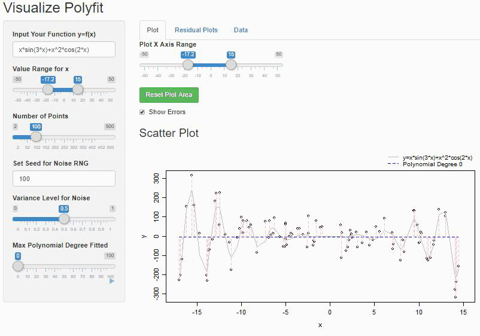


Launch App


---

## Introduction

The aim of this project is to provide an educational tool that enhances understanding of Polynomial Regression1, model complexity, 
and the trade-offs between model fit and over-fitting in data analysis and predictive modeling.

The final product is an interactive app built using [R Shiny](https://www.rstudio.com/products/shiny/). This application will allow users to explore 
polynomial regression by adjusting the degree of the polynomial along with other inputs to observe real-time updatesto the regression line, residual 
plots and key statistical metrics. 

## Background

During my undergraduate studies, I was fascinated by the numerical methods used to find approximate solutions for problems 
where exact solutions are difficult to obtain. These methods form the backbone of many machine learning algorithms, such as numerical linear algebra2 for solving 
regression problems with large datasets, optimization algoithm like gradient descent3 for minimizing cost functions, and backpropagation4 for solving 
complex chained derivatives when training neural networks5. This fascination inpired me to create an interactive tool that demonstrates these principles in action.

## Building the App

The application is built using [R Shiny](https://shiny.posit.co/r/articles/start/build/), a powerful tool beloved by *R* enthusiasts and those interested in creating interactive 
dashboards using the wide range of statistical modeling packages native in *R*.

[R Shiny](https://shiny.posit.co/r/articles/start/build/) simplifies deployment to local environments with minimal effort, although mastering 
its UI syntax requires some learning, unlike tools such as [Dash](https://dash.plotly.com/) that supports syntax similar to HTML in *Python*.

The source code can be found here at [ GitHub](https://github.com/stevenlio88/Polyfit).

## How to use the App

**User Inputs:**
1. Input expression for the function *f(x)* to generate sample data points for the application
2. Adjust the range of input values for *x* in **Value Range for x** input box
3. User can increase or decrease the **Number of Points** to be generated
4. **Set Seed for Noise RNG** for generating the same set of random points
5. Adjust the **Variance Level for Noise** in the data - higher variance makes the data noisier and appear more random
6. **Max Polynomial Degree Fitted** controls the maximum degree of the polynomial used. Click the tiny Play button to visualize animated changes as higher polynomial degrees are added
7. **Plot X Axis Range** to change the area of the plot to be viewed based on the ranges of the *x* values

**Tabs:** 
* **Plot**  
		User inputs and the main plot area for visualization as well as the regression summary details
* **Residual Plots**  
		Residual plots of the model predictions vs actual values as higher degree polynomials is added
* **Data**  
		All raw input and model prediction values in a table

## Conclusion

Thank you for reading! If you like to learn more details about Polynomial Regression1 you can also
check out this article I wrote on Medium [ Polynomial Regression〰️](https://stevenlio.medium.com/polynomial-regression-%EF%B8%8F-e0e20bfbe9d5)
and play with the app as you read it or leave a comment below (GitHub required).

## References

1[Polynomial Regression](https://en.wikipedia.org/wiki/Polynomial_regression)
2[Numerical Linear Algebra](https://en.wikipedia.org/wiki/Numerical_linear_algebra)
3[Gradient Descent](https://en.wikipedia.org/wiki/Gradient_descent)
4[Backpropagation](https://en.wikipedia.org/wiki/Backpropagation)
5[Neural Networks](https://en.wikipedia.org/wiki/Neural_network)

