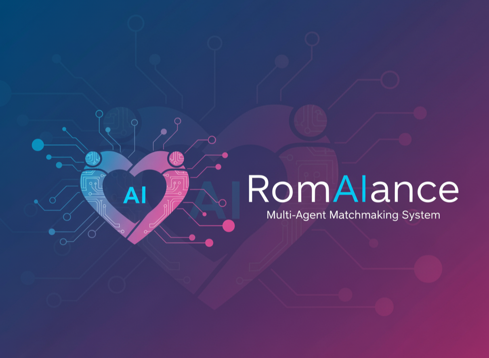

## Introduction

Online dating can be overwhelming. Writing a profile is awkward, finding meaningful matches is time-consuming, and starting a conversation can feel intimidating.

During the [5-Day AI Agents Intensive Course with Google](https://www.kaggle.com/learn-guide/5-day-agents) (Nov 10–14, 2025), I built RomAIance — an interactive AI-powered matchmaking demo that leverages a Multi-Agent System using Google ADK and agents powered by Google's [Gemini-2.5-flash-lite](https://docs.cloud.google.com/vertex-ai/generative-ai/docs/models/gemini/2-5-flash-lite).

While the project is intentionally small in scope, it explores a big idea:
>What if AI agents collaborated to bring a personalized, human-like touch to the entire matchmaking process?

Full code and technical details can be found here on GitHub: https://github.com/stevenlio88/RomAIance

## Why Build RomIance?

Online dating platforms give users endless choices but very little guidance. Many people struggle to:

- Express themselves authentically on their profiles
- Identify who they are actually compatible with
- Craft thoughtful messages that lead to real conversations

RomAIance aims to soften these pain points by using coordinated AI agents to understand the user, reason about compatibility, and assist with communication - all while staying interactive and conversational.

## System Overview: A Multi-Agent Workflow

The app is built using Google ADK, which provides a structured framework for building LLM-driven multi-agent systems. The agents collaborate under an orchestrator (the Root Agent), passing information, refining reasoning, and calling tools as needed.

### RomAIance consists of three primary agents:

**1. Profile Builder Agent**

- Collects user information through natural conversation
- Helps users articulate interests, values, and personality traits
- Generates a structured dating profile

The focus is on *warmth* and *expressiveness*, making it easier for users who find self-description challenging.

**2. Match Finder Agent**

- Takes the user's profile as input
- Evaluates compatibility criteria (preferences, interests, values)
- Returns potential matches based on structured logic
- Explains why a match might be interesting

This agent highlights where the LLM's reasoning helps — but also reveals some limitations (behavioral alignment, logical consistency, and occasional hallucinations), which were part of the learning experience.

**3. Message Composer Agent**

- Crafts conversation starters or replies
- Tailors tone and content to the user and match
- Encourages authenticity rather than generic lines

The goal isn't automation — it's augmentation: helping users say what they want to say.

### How the Agents Communicate

Google ADK's orchestration enables a clean, modular structure:

- Each agent has a clear role and instruction set
- Shared memory (in JSON structures) flows between agents
- User's profile can be create / update / fetch in database (SQLite)
- Agents instructed to assist and provide recommendation throughout the process
- The orchestrator decides which agent should act next

This architecture mirrors how human matchmaking might work - different "experts" contributing where they're strongest.

## Key Influences and Design Choices

### Multi-Agent Reasoning

The project demonstrates how multiple LLMs (or multiple roles of one LLM) can collaborate to achieve:
- Profile abstraction (Bio)
- Compatibility reasoning
- Personalized message generation

### Limitations Observed
During the build, I encountered:
- Occasional breakdowns in logical matching
- Missing outputs after some function calls
- Difficulty enforcing strict schemas
- Variability in conversation flow

Most of these limitations stem from the LLM's inherent randomness and its challenges with long chains of thought. 

The limitations and caveats are documented in the repo as areas for future improvement.

## What I Learned

Building RomAIance offered hands-on insights into working with LLMs and multi-agent systems. Key takeaways included:

- **Prompt engineering** is critical: Small changes in wording significantly affect outputs, so careful design and iteration are essential.
- **Managing randomness**: LLM responses vary even for the same input, requiring validation and fallback strategies.
- **User interaction challenges**: Users can be misled by overly confident AI outputs, highlighting the need for clear guidance.
- **Leveraging LLMs for prompts**: LLMs can help generate or refine prompts for other agents, speeding up development and maintaining consistency.
- **Multi-agent coordination**: Specialized agents improve personalization but add complexity in orchestrating interactions and handling conflicts.

Overall, the project emphasized that applied AI is as much about designing thoughtful interactions and processes as it is about model performance.

## Final Thoughts

RomAIance explores a simple but meaningful idea:
AI (LLM) can make digital matchmaking feel more human by helping people express themselves better.

Building this system with Google ADK showed how multi-agent coordination can transform user interactions into something more thoughtful, personal, and guided.

I hope RomAIance gives you a helpful blueprint - or at least a spark of inspiration.