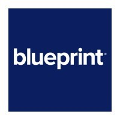
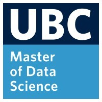
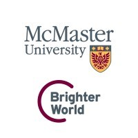

## Technical Skills

* Programming Languages:
	* [Python](https://www.python.org/), [R](https://www.r-project.org/), [SQL](https://en.wikipedia.org/wiki/SQL)
	* [C#](https://en.wikipedia.org/wiki/C_Sharp_(programming_language)), [VB.NET](https://en.wikipedia.org/wiki/Visual_Basic_(.NET)), [.Net Development](https://dotnet.microsoft.com/en-us/learn/dotnet/what-is-dotnet)
	* [Html](https://www.w3schools.com/html/), [CSS](https://www.w3schools.com/css/)
* Machine Learning Libraries:
	* [PyTorch](https://pytorch.org/), [TensorFlow](https://www.tensorflow.org/), [scikit-learn](https://scikit-learn.org/stable/), [SciPy](https://scipy.org/), [pandas](https://pandas.pydata.org/), [numpy](https://numpy.org/), [OpenCV](https://opencv.org/), [Pillow](https://pillow.readthedocs.io/en/stable/)
* Data Visualization: 
	* [Dash](https://dash.plotly.com/), [Shiny](https://www.rstudio.com/products/shiny/), [Plotly](https://plotly.com/), [Vega-Altair](https://altair-viz.github.io/), [matplotlib](https://matplotlib.org/), [ggplot](https://ggplot2.tidyverse.org/index.html)
	* [Tableau](https://www.tableau.com/), [PowerBI](https://www.microsoft.com/en-ca/power-platform/products/power-bi/desktop)
* Software Development:
	* [Git](https://git-scm.com/), [Github](https://github.com/stevenlio88), [Jira](https://www.atlassian.com/software/jira), [Jenkins](https://www.jenkins.io/), [Docker](https://www.docker.com/), [PowerShell](https://learn.microsoft.com/en-us/powershell/), [bash](https://www.gnu.org/software/bash/)
* Other tools:
	* [Microsoft SQL Server](https://en.wikipedia.org/wiki/Microsoft_SQL_Server), [Visual Studio](https://visualstudio.microsoft.com/)
	* [ArcGIS](https://www.arcgis.com/index.html), [QGIS](https://www.qgis.org/en/site/)
	* [SAS EG](https://www.sas.com/en_ca/home.html), [MATLAB](https://www.mathworks.com/products/matlab.html), [MicroStrategy](https://www.microstrategy.com/)
	* [Power Automate Desktop](https://www.microsoft.com/en-ca/power-platform/products/power-automate), [UiPath](https://www.uipath.com/), [Automation 360](https://www.automationanywhere.com/products/automation-360), [BluePrism](https://www.blueprism.com/)
* Analytics topics:
	* Customer Value Prediction, Customer Segmentation, Sentiment Analysis
	* Seaonality Analysis, Market Potential and Shares Estimation, Competitor Analysis
	* Pre & Post Campaign Analysis, Optimizing Sales Channel
	
------

## Professional Experience

**Data Scientist** · [Blueprint Software System](https://www.blueprintsys.com/) 
<kbd>Sep, 2022 – Jun, 2024</kbd>

**Quality Assurance Business Analyst** · [Blueprint Software System](https://www.blueprintsys.com/) 
<kbd>Apr, 2021 – Aug, 2022</kbd>

**Data Scientist** · [Bell Mobility](https://www.bell.ca/Mobility/) 
<kbd>Jan, 2020 – Dec, 2020</kbd>

**Market Insight Analyst** · [Bell Mobility](https://www.bell.ca/Mobility/) 
<kbd>Aug, 2017 – Dec, 2019</kbd>

**Data QA Analyst** · [Environment and Climate Change Canada](https://weather.gc.ca/canada_e.html) 
<kbd>May, 2016 – Apr, 2017</kbd>

------

## Co-op / Internship

**Data QA Support** · [Environment and Climate Change Canada](https://weather.gc.ca/canada_e.html)</a> 
<kbd>May, 2015 – Dec, 2015</kbd>

**Assistant Methodologist** · [Statistics Canada](https://www.statcan.gc.ca/en/start)</a> 
<kbd>Jan, 2014 – Aug, 2014</kbd>

------

## Projects

**Image Segmentation of Coral Baby** · Personal Project 
<kbd>Jan, 2023 - Jun, 2023</kbd>

* Developed an image segmentation model using a [U-Net](https://en.wikipedia.org/wiki/U-Net#:~:text=U%2DNet%20is%20a%20convolutional,of%20the%20University%20of%20Freiburg.) architecture with [ResNet](https://en.wikipedia.org/wiki/Residual_neural_network) backbone, transfer learning using pre-trained weights from [ImageNet](https://www.image-net.org/) to highlight area of coral babies in images of coral frags

**Photo of Photo** · Trusting Pixels Inc. 
<kbd>May, 2022 - Jun, 2022</kbd>

* Collaborated on a team to develop a proof-of-concept machine learning model to detect recaptured images
* Built an interactive Dash application incorporating the best model, allowing users to annotate and identify false recaptured images
* [Project Page](/projects/photo_photo)

**Polyfit** · Personal Project 
<kbd>Feb, 2021 - Feb, 2021</kbd>
* Interactive R Shiny tool for visualizing curve fitting using polynomials
* [Project Page](/projects/polyfit), [ GitHub](https://github.com/stevenlio88/Polyfit)
* 
Launch App


------

## Education

**Masters of Data Science** 
<a href="https://masterdatascience.ubc.ca/">University of British Columbia</a> 
<kbd>Sep, 2021 - Aug, 2022</kbd>

**Honors Bachelor of Science - Mathematics and Statistics Co-op** 
<a href="https://scce.science.mcmaster.ca/">McMaster University</a> 
<kbd>Sep, 2011 - Aug, 2016</kbd>

## Misc. Information

* Languages: English, Cantonese, Mandarin

------


Download Résumé
